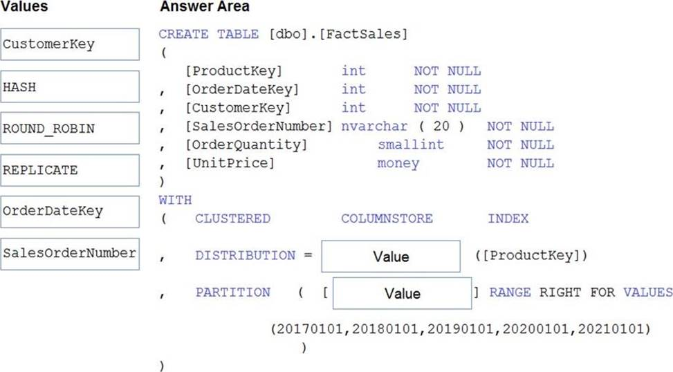
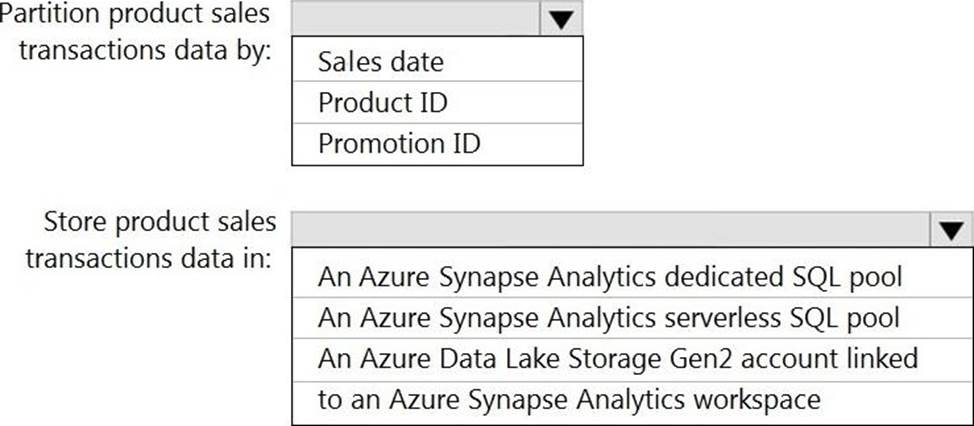

### You have an Azure Synapse Analytics dedicated SQL Pool1. Pool1 contains a partitioned fact table named dbo.Sales and a staging table named stg.Sales that has the matching table and partition definitions. You need to overwrite the content of the first partition in dbo.Sales with the content of the same partition in stg.Sales. The solution must minimize load times. What should you do?

- [ ] Switch the first partition from dbo.Sales to stg.Sales.
- [x] Switch the first partition from stg.Sales to dbo. Sales.
- [ ] Update dbo.Sales from stg.Sales.
- [ ] Insert the data from stg.Sales into dbo.Sales.

### Solution: You create a Standard cluster for each data scientist, a High Concurrency cluster for the data engineers, and a High Concurrency cluster for the jobs. Does this meet the goal?

- [x] Yes
- [ ] No

### Solution: You use a session window that uses a timeout size of 10 seconds. Does this meet the goal?

- [ ] Yes
- [x] No

### Solution: You create a High Concurrency cluster for each data scientist, a High Concurrency cluster for the data engineers, and a Standard cluster for the jobs. Does this meet the goal?

- [ ] Yes
- [x] No

### You have an Azure Data Factory instance that contains two pipelines named Pipeline1 and Pipeline2. Pipeline1 has the activities shown in the following exhibit. Pipeline2 has the activities shown in the following exhibit. You execute Pipeline2, and Stored procedure1 in Pipeline1 fails.

- [x] Pipeline1 and Pipeline2 succeeded.
- [ ] Pipeline1 and Pipeline2 failed.
- [ ] Pipeline1 succeeded and Pipeline2 failed.
- [ ] Pipeline1 failed and Pipeline2 succeeded.

### You have an Azure Databricks resource. You need to log actions that relate to changes in compute for the Databricks resource. Which Databricks services should you log?

- [ ] clusters
- [x] workspace
- [ ] DBFS
- [ ] SSH
- [ ] lobs

### Solution: In an Azure Synapse Analytics pipeline, you use a Get Metadata activity that retrieves the DateTime of the files. Does this meet the goal?

- [ ] Yes
- [x] No

### Solution: You use a tumbling window, and you set the window size to 10 seconds. Does this meet the goal?

- [x] Yes
- [ ] No

### What should you do to improve high availability of the real-time data processing solution?

- [x] Deploy identical Azure Stream Analytics jobs to paired regions in Azure.
- [ ] Deploy a High Concurrency Databricks cluster.
- [ ] Deploy an Azure Stream Analytics job and use an Azure Automation runbook to check the status of the job and to start the job if it stops.
- [ ] Set Data Lake Storage to use geo-redundant storage (GRS).

### Topic 3, Mix Questions You configure monitoring for a Microsoft Azure SQL Data Warehouse implementation. The implementation uses PolyBase to load data from comma-separated value (CSV) files stored in Azure Data Lake Gen 2 using an external table. Files with an invalid schema cause errors to occur. You need to monitor for an invalid schema error. For which error should you monitor?

- [ ] EXTERNAL TABLE access failed due to internal error: ‘Java exception raised on call to HdfsBridge_Connect: Error [com.microsoft.polybase.client.KerberosSecureLogin] occurred while accessing external files.’
- [ ] EXTERNAL TABLE access failed due to internal error: ‘Java exception raised on call to HdfsBridge_Connect: Error [No FileSystem for scheme: wasbs] occurred while accessing external file.’
- [x] Cannot execute the query "Remote Query" against OLE DB provider "SQLNCLI11": for linked server "(null)", Query aborted- the maximum reject threshold (o rows) was reached while regarding from an external source: 1 rows rejected out of total 1 rows processed.
- [ ] EXTERNAL TABLE access failed due to internal error: ‘Java exception raised on call to HdfsBridge_Connect: Error [Unable to instantiate LoginClass] occurred while accessing external files.’

### HOTSPOT You need to design a data storage structure for the product sales transactions. The solution must meet the sales transaction dataset requirements. What should you include in the solution? To answer, select the appropriate options in the answer area. NOTE: Each correct selection is worth one point.

- [ ] Box 1: Round-robin. Box 2: Configure a clustered index.
- [ ] Box 1: Replicated. Box 2: Configure a clustered index.
- [x] Box 1: Hash. Box 2: Set the distribution column to the sales date.
- [ ] Box 1: Round-robin. Box 2: Set the distribution column to product ID.

### Solution: You use a dedicated SQL pool to create an external table that has a additional DateTime column. Does this meet the goal?

- [x] Yes
- [ ] No

### Solution: You modify the files to ensure that each row is less than 1 MB. Does this meet the goal?

- [x] Yes
- [ ] No

### Solution: You create a Standard cluster for each data scientist, a Standard cluster for the data engineers, and a High Concurrency cluster for the jobs. Does this meet the goal?

- [ ] Yes
- [x] No

### Solution: You convert the files to compressed delimited text files. Does this meet the goal?

- [x] Yes
- [ ] No

### You are designing a slowly changing dimension (SCD) for supplier data in an Azure Synapse Analytics dedicated SQL pool. You plan to keep a record of changes to the available fields. The supplier data contains the following columns.

- [ ] surrogate primary key
- [ ] foreign key
- [x] effective start date
- [x] effective end date
- [ ] last modified date
- [x] business key

### You are designing the folder structure for an Azure Data Lake Storage Gen2 container. Users will query data by using a variety of services including Azure Databricks and Azure Synapse Analytics serverless SQL pools. The data will be secured by subject area. Most queries will include data from the current year or current month.

- [ ] /{SubjectArea}/{DataSource}/{DD}/{MM}/{YYYY}/{FileData}_{YYYY}_{MM}_{DD}.csv
- [ ] /{DD}/{MM}/{YYYY}/{SubjectArea}/{DataSource}/{FileData}_{YYYY}_{MM}_{DD}.csv
- [ ] /{YYYY}/{MM}/{DD}/{SubjectArea}/{DataSource}/{FileData}_{YYYY}_{MM}_{DD}.csv
- [x] /{SubjectArea}/{DataSource}/{YYYY}/{MM}/{DD}/{FileData}_{YYYY}_{MM}_{DD}.csv

### You need to implement the surrogate key for the retail store table. The solution must meet the sales transaction dataset requirements.

- [x] a table that has an IDENTITY property
- [ ] a system-versioned temporal table
- [ ] a user-defined SEQUENCE object
- [ ] a table that has a FOREIGN KEY constraint

### DRAG DROP You have an Azure Stream Analytics job that is a Stream Analytics project solution in Microsoft Visual Studio. The job accepts data generated by IoT devices in the JSON format. You need to modify the job to accept data generated by the IoT devices in the Protobuf format. Which three actions should you perform from Visual Studio on sequence? To answer, move the appropriate actions from the list of actions to the answer area and arrange them in the correct order.

### HOTSPOT You have two Azure Storage accounts named Storage1 and Storage2. Each account holds one container and has the hierarchical namespace enabled. The system has files that contain data stored in the Apache Parquet format. You need to copy folders and files from Storage1 to Storage2 by using a Data Factory copy activity. The solution must meet the following requirements: ✑ No transformations must be performed. ✑ The original folder structure must be retained. ✑ Minimize time required to perform the copy activity. How should you configure the copy activity?

- [x] Box 1: Parquet. Box 2: PreserveHierarchy.
- [ ] Box 1: PreserveHierarchy. Box 2: Parquet.
- [ ] Box 1: FlattenHierarchy. Box 2: Parquet.
- [ ] Box 1: Parquet. Box 2: FlattenHierarchy.

### DRAG DROP You need to implement versioned changes to the integration pipelines. The solution must meet the data integration requirements. In which order should you perform the actions?

- [ ] Box 1: Create a feature branch. Box 2: Merge changes. Box 3: Create a repository and a main branch. Box 4: Create a pull request. Box 5: Publish changes.
- [ ] Box 1: Publish changes. Box 2: Create a repository and a main branch. Box 3: Merge changes. Box 4: Merge changes. Box 5: Publish changes.
- [x] Box 1: Create a repository and a main branch. Box 2: Create a feature branch. Box 3: Create a pull request. Box 4: Merge changes. Box 5: Publish changes.
- [ ] Box 1: Create a feature branch. Box 2: Create a pull request. Box 3: Merge changes. Box 4: Create a repository and a main branch. Box 5: Publish changes.

### You need to design a data retention solution for the Twitter feed data records. The solution must meet the customer sentiment analytics requirements. Which Azure Storage functionality should you include in the solution?

- [ ] change feed
- [ ] soft delete
- [ ] time-based retention
- [x] lifecycle management

### You need to implement a Type 3 slowly changing dimension (SCD) for product category data in an Azure Synapse Analytics dedicated SQL pool. You have a table that was created by using the following Transact-SQL statement. Which two columns should you add to the table?

- [ ] [EffectiveScarcDate] [datetime] NOT NULL,
- [x] [CurrentProduccCacegory] [nvarchar] (100) NOT NULL,
- [ ] [EffectiveEndDace] [dacecime] NULL,
- [ ] [ProductCategory] [nvarchar] (100) NOT NULL,
- [x] [OriginalProduccCacegory] [nvarchar] (100) NOT NULL,

### You are designing a highly available Azure Data Lake Storage solution that will induce geo-zone-redundant storage (GZRS). You need to monitor for replication delays that can affect the recovery point objective (RPO).

- [x] Last Sync Time
- [ ] Average Success Latency
- [ ] Error errors
- [ ] availability

### You are monitoring an Azure Stream Analytics job. The Backlogged Input Events count has been 20 for the last hour. You need to reduce the Backlogged Input Events count. What should you do?

- [ ] Drop late arriving events from the job.
- [ ] Add an Azure Storage account to the job.
- [x] Increase the streaming units for the job.
- [ ] Stop the job.

### HOTSPOT You are building an Azure Stream Analytics job to identify how much time a user spends interacting with a feature on a webpage. The job receives events based on user actions on the webpage. Each row of data represents an event. Each event has a type of either ‘start’ or ‘end’. You need to calculate the duration between start and end events. How should you complete the query? To answer, select the appropriate options in the answer area. NOTE: Each correct selection is worth one point.

- [ ] Box 1: DATEPART. Box 2: DATEADD.
- [ ] Box 1: DATEDIFF. Box 2: LAST.
- [ ] Box 1: DATEADD. Box 2: DATEPART.
- [ ] Box 1: DATEADD. Box 2: DATEPART.

### DRAG DROP You have the following table named Employees. You need to calculate the employee_type value based on the hire_date value. How should you complete the Transact-SQL statement?

- [ ] Box 1: ELSE. Box 2: CASE.
- [ ] Box 1: CASE. Box 2: OVER.
- [ ] Box 1: ELSE. Box 2: OVER.
- [x] Box 1: CASE. Box 2: ELSE.

### HOTSPOT You are building an Azure Stream Analytics job to retrieve game data. You need to ensure that the job returns the highest scoring record for each five-minute time interval of each game. How should you complete the Stream Analytics query?

- [x] SELECT: TopOne OVER(PARTITION BY Game ORDER BY Score Desc). GROUP BY: Tumbling(minute, 5).
- [ ] SELECT: CollectTop(1)OVER(ORDER BY Score Desc). GROUP BY: Tumbling(minute, 5).
- [ ] SELECT: TopOne OVER(PARTITION BY Game ORDER BY Score Desc). GROUP BY: Game.
- [ ] SELECT: CollectTop(1)OVER(ORDER BY Score Desc). GROUP BY: TopOne OVER(PARTITION BY Game ORDER BY Score Desc).

### HOTSPOT You need to design an analytical storage solution for the transactional data. The solution must meet the sales transaction dataset requirements. What should you include in the solution?

- [ ] Table type to store retail store data: Hash. Table type to store promotional data: Round-robin.
- [ ] Table type to store retail store data: Replicated. Table type to store promotional data: Round-robin.
- [ ] Table type to store retail store data: Hash. Table type to store promotional data: Replicated.
- [x] Table type to store retail store data: Round-robin. Table type to store promotional data: Hash.

### You need to design a data retention solution for the Twitter teed data records. The solution must meet the customer sentiment analytics requirements.Which Azure Storage functionality should you include in the solution?

- [ ] time-based retention
- [ ] change feed
- [ ] soft delete
- [x] Iifecycle management

### You have files and folders in Azure Data Lake Storage Gen2 for an Azure Synapse workspace as shown in the following exhibit. You create an external table named ExtTable that has LOCATION=’/topfolder/’. When you query ExtTable by using an Azure Synapse Analytics serverless SQL pool, which files are returned?

- [ ] File2.csv and File3.csv only
- [x] File1.csv and File4.csv only
- [ ] File1.csv, File2.csv, File3.csv, and File4.csv
- [ ] File1.csv only

### You build a data warehouse in an Azure Synapse Analytics dedicated SQL pool. Analysts write a complex SELECT query that contains multiple JOIN and CASE statements to transform data for use in inventory reports. The inventory reports will use the data and additional WHERE parameters depending on the report. The reports will be produced once daily. You need to implement a solution to make the dataset available for the reports. The solution must minimize query times. What should you implement?

- [x] a materialized view
- [ ] a replicated table
- [ ] in ordered clustered columnstore index
- [ ] result set chaching

### You are designing an Azure Synapse Analytics dedicated SQL pool. You need to ensure that you can audit access to Personally Identifiable information (PII). What should you include in the solution?

- [ ] dynamic data masking
- [ ] row-level security (RLS)
- [x] sensitivity classifications
- [ ] column-level security

### DRAG DROP You plan to create a table in an Azure Synapse Analytics dedicated SQL pool. Data in the table will be retained for five years. Once a year, data that is older than five years will be deleted. You need to ensure that the data is distributed evenly across partitions. The solution must minimize the amount of time required to delete old data. How should you complete the Transact-SQL statement?

- [x] Box 1: HASH. Box 2: OrderDateKey.
- [ ] Box 1: OrderDateKey. Box 2: CustomerKey.
- [ ] Box 1: CustomerKey. Box 2: HASH.
- [ ] Box 1: CustomerKey. Box 2: HASH.

### You use Azure Stream Analytics to receive Twitter data from Azure Event Hubs and to output the data to an Azure Blob storage account. You need to output the count of tweets during the last five minutes every five minutes. Each tweet must only be counted once. Which windowing function should you use?

- [ ] a five-minute Session window
- [ ] a five-minute Sliding window
- [x] a five-minute Tumbling window
- [ ] a five-minute Hopping window that has one-minute hop

### What should you recommend using to secure sensitive customer contact information?

- [ ] data labels
- [x] column-level security
- [ ] row-level security
- [ ] Transparent Data Encryption (TDE)

### HOTSPOT You need to implement an Azure Synapse Analytics database object for storing the sales transactions data. The solution must meet the sales transaction dataset requirements. What solution must meet the sales transaction dataset requirements. What should you do?

- [ ] Box 1: RANGE LEFT FOR VALUES. Box 2: FORMAT TYRIONS.
- [ ] Box 1: CREATE VIEW. Box 2: CREATE EXTERNAL TABLE.
- [ ] Box 1: FORMAT TYRIONS. Box 2: RANGE LEFT FOR VALUES.
- [x] Box 1: CREATE TABLE. Box 2: RANGE RIGHT FOR VALUES.

### You are designing a security model for an Azure Synapse Analytics dedicated SQL pool that will support multiple companies. You need to ensure that users from each company can view only the data of their respective company . Which two objects should you include in the solution? Each correct answer presents part of the solution NOTE: Each correct selection it worth one point.

- [ ] a custom role-based access control (RBAC) role.
- [ ] asymmetric keys
- [x] a predicate function
- [ ] a column encryption key
- [x] a security policy

### HOTSPOT You need to design the partitions for the product sales transactions. The solution must meet the sales transaction dataset requirements. What should you include in the solution?

- [ ] Box 1: An Azure Synapse Analytics dedicated SQL pool. Box 2: Promotion ID.
- [x] Box 1: Sales date. Box 2: An Azure Synapse Analytics dedicated SQL pool.
- [ ] Box 1: An Azure Synapse Analytics dedicated SQL pool. Box 2: Promotion ID.
- [ ] Box 1: Promotion ID. Box 2: Sales date.

### You need to integrate the on-premises data sources and Azure Synapse Analytics. The solution must meet the data integration requirements. Which type of integration runtime should you use?

- [ ] Azure-SSIS integration runtime
- [ ] self-hosted integration runtime
- [x] Azure integration runtime

### HOTSPOT You have an Azure SQL database named Database1 and two Azure event hubs named HubA and HubB. The data consumed from each source is shown in the following table. You need to implement Azure Stream Analytics to calculate the average fare per mile by driver. How should you configure the Stream Analytics input for each source?

- [ ] Box 1: Reference. Box 2: Stream. Box 3 Stream.
- [ ] Box 1: Reference. Box 2: Reference. Box 3 Stream.
- [x] Box 1: Stream. Box 2: Stream. Box 3 Reference.
- [ ] Box 1: Reference. Box 2: Stream. Box 3 Stream.

### You create an Azure Databricks cluster and specify an additional library to install. When you attempt to load the library to a notebook, the library in not found. You need to identify the cause of the issue. What should you review?

- [ ] notebook logs
- [ ] cluster event logs
- [c] global init scripts logs
- [ ] workspace logs

### You are designing an Azure Databricks table. The table will ingest an average of 20 million streaming events per day. You need to persist the events in the table for use in incremental load pipeline jobs in Azure Databricks. The solution must minimize storage costs and incremental load times. What should you include in the solution?

- [ ] Partition by DateTime fields.
- [x] Sink to Azure Queue storage.
- [ ] Include a watermark column.
- [ ] Use a JSON format for physical data storage.

### CORRECT TEXT The storage account container view is shown in the Refdata exhibit. (Click the Refdata tab.) You need to configure the Stream Analytics job to pick up the new reference data . What should you configure?

- [x] box 1: {date)/product.csv. Box 2: YYYY-MM-DD.
- [ ] box 1: product.csv. Box 2: YYYY/MM/DD.
- [ ] box 1: {date)/product.csv. Box 2: YYYY/MM/DD.
- [ ] box 1: product.csv. Box 2: {date)/product.csv.

### You are designing a solution that will copy Parquet files stored in an Azure Blob storage account to an Azure Data Lake Storage Gen2 account. The data will be loaded daily to the data lake and will use a folder structure of {Year}/{Month}/{Day}/. You need to design a daily Azure Data Factory data load to minimize the data transfer between the two accounts. Which two configurations should you include in the design?

- [ ] Delete the files in the destination before loading new data.
- [x] Filter by the last modified date of the source files.
- [ ] Delete the source files after they are copied.
- [x] Specify a file naming pattern for the destination.

### DRAG DROP You have an Azure Synapse Analytics workspace named WS1. You have an Azure Data Lake Storage Gen2 container that contains JSON-formatted files in the following format. You need to use the serverless SQL pool in WS1 to read the files. How should you complete the Transact-SQL statement?

- [x] Box 1: openrowset. Box 2: openjson.
- [ ] Box 1: openquezy. Box 2: openrowset.
- [ ] Box 1: openjson. Box 2: openrowset.
- [ ] Box 1: openquezy. Box 2: openrowset.

### HOTSPOT You need to implement an Azure Databricks cluster that automatically connects to Azure Data lake Storage Gen2 by using Azure Active Directory (Azure AD) integration . How should you configure the new clutter?

- [ ] Box 1: Premium. Box 2: Standara.
- [ ] Box 1: Standara. Box 2: Table Access Gentrol.
- [x] Box 1: Premium. Box 2: Azure Data Lake Storage Credential Passtrough .
- [ ] Box 1: Standara. Box 2: Premium.

### HOTSPOT You plan to create a real-time monitoring app that alerts users when a device travels more than 200 meters away from a designated location. You need to design an Azure Stream Analytics job to process the data for the planned app. The solution must minimize the amount of code developed and the number of technologies used. What should you include in the Stream Analytics job?

- [ ] Box 1: Reference. Box 2: Windowing.
- [x] Box 1: Stream. Box 2: Geospatial.
- [ ] Box 1: Reference. Box 2: Stream.
- [ ] Box 1: Geospatial. Box 2: Stream.

### HOTSPOT You have a self-hosted integration runtime in Azure Data Factory. The current status of the integration runtime has the following configurations: ✑ Status: Running ✑ Type: Self-Hosted ✑ Version: 4.4.7292.1 ✑ Running / Registered Node(s): 1/1 ✑ High Availability Enabled: False ✑ Linked Count: 0 ✑ Queue Length: 0 ✑ Average Queue Duration. 0.00s The integration runtime has the following node details: ✑ Name: X-M ✑ Status: Running ✑ Version: 4.4.7292.1 ✑ Available Memory: 7697MB ✑ CPU Utilization: 6% ✑ Network (In/Out): 1.21KBps/0.83KBps ✑ Concurrent Jobs (Running/Limit): 2/14 ✑ Role: Dispatcher/Worker ✑ Credential Status: In Sync Use the drop-down menus to select the answer choice that completes each statement based on the information presented.

- [ ] Box 1: lowered. Box 2: fail until the node comes back online.
- [ ] Box 1: raised. Box 2: fail until the node comes back online.
- [ ] Box 1: exceed the CPU limit. Box 2: raised.
- [ ] Box 1: fail until the node comes back online. Box 2: lowered.

### You are designing an Azure Databricks interactive cluster. The cluster will be used infrequently and will be configured for auto-termination. You need to ensure that the cluster configuration is retained indefinitely after the cluster is terminated. The solution must minimize costs. What should you do?

- [ ] Clone the cluster after it is terminated.
- [ ] Terminate the cluster manually when processing completes.
- [ ] Create an Azure runbook that starts the cluster every 90 days.
- [x] Pin the cluster.

### You are developing an application that uses Azure Data Lake Storage Gen 2. You need to recommend a solution to grant permissions to a specific application for a limited time period. What should you include in the recommendation?

- [ ] Azure Active Directory (Azure AD) identities
- [x] shared access signatures (SAS)
- [ ] account keys
- [ ] role assignments

### You have two Azure Data Factory instances named ADFdev and ADFprod. ADFdev connects to an Azure DevOps Git repository. You publish changes from the main branch of the Git repository to ADFdev. You need to deploy the artifacts from ADFdev to ADFprod. What should you do first?

- [ ] From ADFdev, modify the Git configuration.
- [ ] From ADFdev, create a linked service.
- [x] From Azure DevOps, create a release pipeline.
- [ ] From Azure DevOps, update the main branch.

### HOTSPOT You develop a dataset named DBTBL1 by using Azure Databricks. DBTBL1 contains the following columns: ✑ SensorTypeID ✑ GeographyRegionID ✑ Year ✑ Month ✑ Day ✑ Hour✑ Minute ✑ Temperature ✑ WindSpeed ✑ Other You need to store the data to support daily incremental load pipelines that vary for each GeographyRegionID. The solution must minimize storage costs. How should you complete the code?

- [x] Box 1: partitionBy. Box 2: ("Year", "Month", "Day", "GeographyRegionID"). Box 3: .saveAsTable(*/DBTBL1").
- [ ] Box 1: .saveAsTable(*/DBTBL1"). Box 2: partitionBy. Box 3: ("Year", "Month", "Day", "GeographyRegionID").
- [ ] Box 1: .saveAsTable(*/DBTBL1"). Box 2: format. Box 3: partitionBy.
- [ ] Box 1: ("Year", "Month", "Day", "GeographyRegionID"). Box 2: partitionBy. Box 3: format.

### HOTSPOT You have an Azure Synapse Analytics dedicated SQL pool that contains the users shown in the following table. User1 executes a query on the database, and the query returns the results shown in the following exhibit. User1 is the only user who has access to the unmasked data. Use the drop-down menus to select the answer choice that completes each statement based on the information presented in the graphic.

- [ ] Box 1: the values stored in the database. Box 2: a random number.
- [ ] Box 1: a random number. Box 2: 1900-01-01.
- [x] Box 1: 0. Box 2: the values stored in the database.
- [ ] Box 1: 1900-01-01. Box 2: a random number.

### HOTSPOT Which Azure Data Factory components should you recommend using together to import the daily inventory data from the SQL server to Azure Data Lake Storage?

- [ ] Box 1: Schedule trigger. Box 2: Copy activity. Box 3: Self-hosted integration runtime.
- [ ] Box 1: Schedule trigger. Box 2: Self-hosted integration runtime. Box 3: Lookup activity.
- [ ] Box 1: Lookup activity. Box 2: Lookup activity. Box 3: Copy activity.
- [x] Box 1: Self-hosted integration runtime. Box 2: Schedule trigger. Box 3: Copy activity.

### DRAG DROP You need to ensure that the Twitter feed data can be analyzed in the dedicated SQL pool. The solution must meet the customer sentiment analytics requirements. Which three Transaction-SQL DDL commands should you run in sequence?

- [ ] Box 1: CREATE EXTERNAL DATA SOURCE. box 2: CREATE EXTERNAL TABLE AS SELECT. Box 3: CREATE EXTERNAL FILE FORMAT.
- [ ] Box 1: CREATE EXTERNAL DATA SOURCE. box 2: CREATE EXTERNAL FILE FORMAT. Box 3: CREATE EXTERNAL TABLE AS SELECT.
- [ ] Box 1: CREATE EXTERNAL TABLE AS SELECT. box 2: CREATE EXTERNAL DATA SOURCE. Box 3: CREATE EXTERNAL FILE FORMAT.
- [ ] Box 1: CREATE EXTERNAL FILE FORMAT. box 2: CREATE EXTERNAL TABLE AS SELECT. Box 3: CREATE EXTERNAL DATA SOURCE.

### You are designing a dimension table for a data warehouse. The table will track the value of the dimension attributes over time and preserve the history of the data by adding new rows as the data changes. Which type of slowly changing dimension (SCD) should use?

- [ ] Type 0
- [ ] Type 1
- [x] Type 2
- [ ] Type 3

### You have an Azure data factory. You need to examine the pipeline failures from the last 60 days. What should you use?

- [ ] the Activity log blade for the Data Factory resource
- [ ] the Monitor & Manage app in Data Factory
- [ ] the Resource health blade for the Data Factory resource
- [x] Azure Monitor

### HOTSPOT You are building an Azure Synapse Analytics dedicated SQL pool that will contain a fact table for transactions from the first half of the year 2020. You need to ensure that the table meets the following requirements: ✑ Minimizes the processing time to delete data that is older than 10 years ✑ Minimizes the I/O for queries that use year-to-date values How should you complete the Transact-SQL statement?

- [x] Box 1: PARTITION. Box 2: (TransactionDatolD).
- [ ] Box 1: (TransactionDatolD). Box 2: PARTITION.
- [ ] Box 1: (TransactionDatolD). Box 2: HASH ( [TransactionTypeIDI] ).
- [ ] Box 1: HASH ( [TransactionTypeIDI] ). Box 2: PARTITION.

### You have an Azure Synapse Analytics dedicated SQL pool named Pool1 and a database named DB1. DB1 contains a fact table named Table1. You need to identify the extent of the data skew in Table1. What should you do in Synapse Studio?

- [ ] Connect to the built-in pool and run dbcc pdw_showspaceused.
- [ ] Connect to the built-in pool and run dbcc checkalloc.
- [ ] Connect to Pool1 and query sys.dm_pdw_node_scacus.
- [x] Connect to Pool1 and query sys.dm_pdw_nodes_db_partition_scacs.

### HOTSPOT You are planning the deployment of Azure Data Lake Storage Gen2. You have the following two reports that will access the data lake: ✑ Report1: Reads three columns from a file that contains 50 columns. ✑ Report2: Queries a single record based on a timestamp. You need to recommend in which format to store the data in the data lake to support the reports. The solution must minimize read times. What should you recommend for each report?

- [ ] Box 1: Avro. Box 2: CSV.
- [ ] Box 1: Avro. Box 2: CSV.
- [ ] Box 1: TSV. Box 2: .Avro
- [x] Box 1: CSV. Box 2: Avro.

### You are designing an Azure Databricks cluster that runs user-defined local processes. You need to recommend a cluster configuration that meets the following requirements: • Minimize query latency. • Maximize the number of users that can run queues on the cluster at the same time « Reduce overall costs without compromising other requirements Which cluster type should you recommend?

- [ ] Standard with Auto termination
- [ ] Standard with Autoscaling
- [x] High Concurrency with Autoscaling
- [ ] High Concurrency with Auto Termination

### HOTSPOT You have an enterprise data warehouse in Azure Synapse Analytics that contains a table named FactOnlineSales. The table contains data from the start of 2009 to the end of 2012. You need to improve the performance of queries against FactOnlineSales by using table partitions. The solution must meet the following requirements: ✑ Create four partitions based on the order date. ✑ Ensure that each partition contains all the orders places during a given calendar year. How should you complete the T-SQL command?

- [ ] Box 1: LEFT. Box 2: RIGHT.
- [ ] Box 1: LEFT. Box 2: 20100101,20110101,20120101.
- [x] Box 1: RIGHT. Box 2: 20100101,20110101,20120101.
- [ ] Box 1: 20100101,20110101,20120101. Box 2: .RIGHT

### You have an Azure Data Lake Storage Gen2 account named adls2 that is protected by a virtual network. You are designing a SQL pool in Azure Synapse that will use adls2 as a source. What should you use to authenticate to adls2?

- [ ] a shared access signature (SAS)
- [x] a managed identity
- [ ] a shared key
- [ ] an Azure Active Directory (Azure AD) user

### HOTSPOT You need to design a data ingestion and storage solution for the Twitter feeds. The solution must meet the customer sentiment analytics requirements. What should you include in the solution?

- [ ] Box 1: An Azure Data Lake Storage Gen2 account. Box 2: Use Event Hubs Dedicated.
- [x] Box 1: Configure Event Hubs partitions. Box 2: An Azure Data Lake Storage Gen2 account.
- [ ] Box 1: Use Event Hubs Dedicated. Box 2: Enable Auto-Inflate in Event Hubs.
- [ ] Box 1: Enable Auto-Inflate in Event Hubs. Box 2: Configure Event Hubs partitions.

### You plan to ingest streaming social media data by using Azure Stream Analytics. The data will be stored in files in Azure Data Lake Storage, and then consumed by using Azure Datiabricks and PolyBase in Azure Synapse Analytics. You need to recommend a Stream Analytics data output format to ensure that the queries from Databricks and PolyBase against the files encounter the fewest possible errors. The solution must ensure that the tiles can be queried quickly and that the data type information is retained. What should you recommend?

- [x] Parquet
- [ ] Avro
- [ ] CSV
- [ ] JSON

### HOTSPOT You are designing a monitoring solution for a fleet of 500 vehicles. Each vehicle has a GPS tracking device that sends data to an Azure event hub once per minute. You have a CSV file in an Azure Data Lake Storage Gen2 container. The file maintains the expected geographical area in which each vehicle should be. You need to ensure that when a GPS position is outside the expected area, a message is added to another event hub for processing within 30 seconds. The solution must minimize cost. What should you include in the solution?

- [ ] Box 1: Point within polygon. Box 2: Azure Stream Analytics. Box 3: Hopping.
- [ ] Box 1: Tumbling. Box 2: Point within polygon. Box 3: Azure Stream Analytics.
- [x] Box 1: Azure Stream Analytics. Box 2: Hopping. Box 3: Point within polygon.
- [ ] Box 1: Tumbling. Box 2: Azure Stream Analytics. Box 3: Hopping.

### You need to trigger an Azure Data Factory pipeline when a file arrives in an Azure Data Lake Storage Gen2 container. Which resource provider should you enable?

- [ ] Microsoft.Sql
- [ ] Microsoft-Automation
- [x] Microsoft.EventGrid
- [ ] Microsoft.EventHub

### You are designing an anomaly detection solution for streaming data from an Azure IoT hub. The solution must meet the following requirements: ✑ Send the output to Azure Synapse. ✑ Identify spikes and dips in time series data. ✑ Minimize development and configuration effort. Which should you include in the solution?

- [ ] Azure Databricks
- [x] Azure Stream Analytics
- [ ] Azure SQL Database

### DRAG DROP You have an Azure Active Directory (Azure AD) tenant that contains a security group named Group1. You have an Azure Synapse Analytics dedicated SQL pool named dw1 that contains a schema named schema1. You need to grant Group1 read-only permissions to all the tables and views in schema1. The solution must use the principle of least privilege. Which three actions should you perform in sequence?

- [x] Box 1: Create a database role named Role1 and grant Rolel SELECT permissions to schemal. Box 2: Assign Rolel to the Groupl database user. Box 3: Assign the Azure role-based access control (Azure RBAC) Reader role for dwl to Group1.
- [ ] Box 1: Assign Rolel to the Groupl database user. Box 2: Create a database role named Role1 and grant Rolel SELECT permissions to schemal. Box 3: Assign the Azure role-based access control (Azure RBAC) Reader role for dwl to Group1.
- [ ] Box 1: Assign the Azure role-based access control (Azure RBAC) Reader role for dwl to Group1. Box 2: Assign Rolel to the Groupl database user. Box 3: Create a database role named Role1 and grant Rolel SELECT permissions to schemal.
- [ ] Box 1: Assign the Azure role-based access control (Azure RBAC) Reader role for dwl to Group1. Box 2: Create a database role named Role1 and grant Rolel SELECT permissions to schemal. Box 3: Assign Rolel to the Groupl database user.

### HOTSPOT You need to output files from Azure Data Factory. Which file format should you use for each type of output?

- [ ] Box 1: Avro. Box 2: GZip.
- [x] Box 1: Parquet. Box 2: Avro.
- [ ] Box 1: GZip. Box 2: Parquet.
- [ ] Box 1: Avro. Box 2: Parquet.

