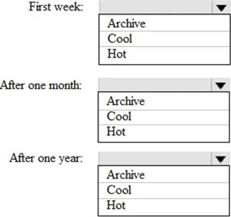
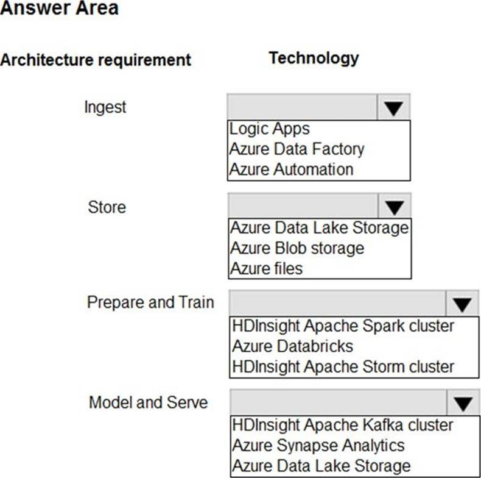
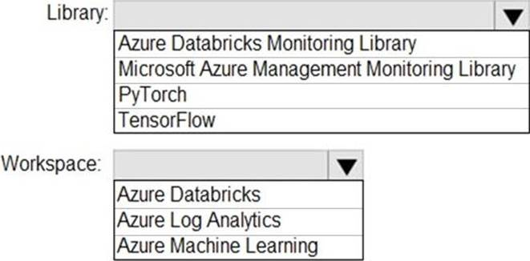

### You have an Azure Synapse Analytics dedicated SQL Pool1. Pool1 contains a partitioned fact table named dbo.Sales and a staging table named stg.Sales that has the matching table and partition definitions. You need to overwrite the content of the first partition in dbo.Sales with the content of the same partition in stg.Sales. The solution must minimize load times. What should you do?

- [ ] Switch the first partition from dbo.Sales to stg.Sales.
- [x] Switch the first partition from stg.Sales to dbo. Sales.
- [ ] Update dbo.Sales from stg.Sales.
- [ ] Insert the data from stg.Sales into dbo.Sales.

### Solution: You create a Standard cluster for each data scientist, a High Concurrency cluster for the data engineers, and a High Concurrency cluster for the jobs. Does this meet the goal?

- [x] Yes
- [ ] No

### Solution: You use a session window that uses a timeout size of 10 seconds. Does this meet the goal?

- [ ] Yes
- [x] No

### Solution: You create a High Concurrency cluster for each data scientist, a High Concurrency cluster for the data engineers, and a Standard cluster for the jobs. Does this meet the goal?

- [ ] Yes
- [x] No

### You have an Azure Data Factory instance that contains two pipelines named Pipeline1 and Pipeline2. Pipeline1 has the activities shown in the following exhibit. Pipeline2 has the activities shown in the following exhibit. You execute Pipeline2, and Stored procedure1 in Pipeline1 fails.

- [x] Pipeline1 and Pipeline2 succeeded.
- [ ] Pipeline1 and Pipeline2 failed.
- [ ] Pipeline1 succeeded and Pipeline2 failed.
- [ ] Pipeline1 failed and Pipeline2 succeeded.

### You have an Azure Databricks resource. You need to log actions that relate to changes in compute for the Databricks resource. Which Databricks services should you log?

- [ ] clusters
- [x] workspace
- [ ] DBFS
- [ ] SSH
- [ ] lobs

### Solution: In an Azure Synapse Analytics pipeline, you use a Get Metadata activity that retrieves the DateTime of the files. Does this meet the goal?

- [ ] Yes
- [x] No

### Solution: You use a tumbling window, and you set the window size to 10 seconds. Does this meet the goal?

- [x] Yes
- [ ] No

### What should you do to improve high availability of the real-time data processing solution?

- [x] Deploy identical Azure Stream Analytics jobs to paired regions in Azure.
- [ ] Deploy a High Concurrency Databricks cluster.
- [ ] Deploy an Azure Stream Analytics job and use an Azure Automation runbook to check the status of the job and to start the job if it stops.
- [ ] Set Data Lake Storage to use geo-redundant storage (GRS).

### Topic 3, Mix Questions You configure monitoring for a Microsoft Azure SQL Data Warehouse implementation. The implementation uses PolyBase to load data from comma-separated value (CSV) files stored in Azure Data Lake Gen 2 using an external table. Files with an invalid schema cause errors to occur. You need to monitor for an invalid schema error. For which error should you monitor?

- [ ] EXTERNAL TABLE access failed due to internal error: ‘Java exception raised on call to HdfsBridge_Connect: Error [com.microsoft.polybase.client.KerberosSecureLogin] occurred while accessing external files.’
- [ ] EXTERNAL TABLE access failed due to internal error: ‘Java exception raised on call to HdfsBridge_Connect: Error [No FileSystem for scheme: wasbs] occurred while accessing external file.’
- [x] Cannot execute the query "Remote Query" against OLE DB provider "SQLNCLI11": for linked server "(null)", Query aborted- the maximum reject threshold (o rows) was reached while regarding from an external source: 1 rows rejected out of total 1 rows processed.
- [ ] EXTERNAL TABLE access failed due to internal error: ‘Java exception raised on call to HdfsBridge_Connect: Error [Unable to instantiate LoginClass] occurred while accessing external files.’

### HOTSPOT You need to design a data storage structure for the product sales transactions. The solution must meet the sales transaction dataset requirements. What should you include in the solution? To answer, select the appropriate options in the answer area. NOTE: Each correct selection is worth one point.

- [ ] Box 1: Round-robin. Box 2: Configure a clustered index.
- [ ] Box 1: Replicated. Box 2: Configure a clustered index.
- [x] Box 1: Hash. Box 2: Set the distribution column to the sales date.
- [ ] Box 1: Round-robin. Box 2: Set the distribution column to product ID.

### Solution: You use a dedicated SQL pool to create an external table that has a additional DateTime column. Does this meet the goal?

- [x] Yes
- [ ] No

### Solution: You modify the files to ensure that each row is less than 1 MB. Does this meet the goal?

- [x] Yes
- [ ] No

### Solution: You create a Standard cluster for each data scientist, a Standard cluster for the data engineers, and a High Concurrency cluster for the jobs. Does this meet the goal?

- [ ] Yes
- [x] No

### Solution: You convert the files to compressed delimited text files. Does this meet the goal?

- [x] Yes
- [ ] No

### You are designing a slowly changing dimension (SCD) for supplier data in an Azure Synapse Analytics dedicated SQL pool. You plan to keep a record of changes to the available fields. The supplier data contains the following columns.

- [ ] surrogate primary key
- [ ] foreign key
- [x] effective start date
- [x] effective end date
- [ ] last modified date
- [x] business key

### You are designing the folder structure for an Azure Data Lake Storage Gen2 container. Users will query data by using a variety of services including Azure Databricks and Azure Synapse Analytics serverless SQL pools. The data will be secured by subject area. Most queries will include data from the current year or current month.

- [ ] /{SubjectArea}/{DataSource}/{DD}/{MM}/{YYYY}/{FileData}_{YYYY}_{MM}_{DD}.csv
- [ ] /{DD}/{MM}/{YYYY}/{SubjectArea}/{DataSource}/{FileData}_{YYYY}_{MM}_{DD}.csv
- [ ] /{YYYY}/{MM}/{DD}/{SubjectArea}/{DataSource}/{FileData}_{YYYY}_{MM}_{DD}.csv
- [x] /{SubjectArea}/{DataSource}/{YYYY}/{MM}/{DD}/{FileData}_{YYYY}_{MM}_{DD}.csv

### You need to implement the surrogate key for the retail store table. The solution must meet the sales transaction dataset requirements.

- [x] a table that has an IDENTITY property
- [ ] a system-versioned temporal table
- [ ] a user-defined SEQUENCE object
- [ ] a table that has a FOREIGN KEY constraint

### DRAG DROP You have an Azure Stream Analytics job that is a Stream Analytics project solution in Microsoft Visual Studio. The job accepts data generated by IoT devices in the JSON format. You need to modify the job to accept data generated by the IoT devices in the Protobuf format. Which three actions should you perform from Visual Studio on sequence? To answer, move the appropriate actions from the list of actions to the answer area and arrange them in the correct order.

### HOTSPOT You have two Azure Storage accounts named Storage1 and Storage2. Each account holds one container and has the hierarchical namespace enabled. The system has files that contain data stored in the Apache Parquet format. You need to copy folders and files from Storage1 to Storage2 by using a Data Factory copy activity. The solution must meet the following requirements: ✑ No transformations must be performed. ✑ The original folder structure must be retained. ✑ Minimize time required to perform the copy activity. How should you configure the copy activity?

- [x] Box 1: Parquet. Box 2: PreserveHierarchy.
- [ ] Box 1: PreserveHierarchy. Box 2: Parquet.
- [ ] Box 1: FlattenHierarchy. Box 2: Parquet.
- [ ] Box 1: Parquet. Box 2: FlattenHierarchy.

### DRAG DROP You need to implement versioned changes to the integration pipelines. The solution must meet the data integration requirements. In which order should you perform the actions?

- [ ] Box 1: Create a feature branch. Box 2: Merge changes. Box 3: Create a repository and a main branch. Box 4: Create a pull request. Box 5: Publish changes.
- [ ] Box 1: Publish changes. Box 2: Create a repository and a main branch. Box 3: Merge changes. Box 4: Merge changes. Box 5: Publish changes.
- [x] Box 1: Create a repository and a main branch. Box 2: Create a feature branch. Box 3: Create a pull request. Box 4: Merge changes. Box 5: Publish changes.
- [ ] Box 1: Create a feature branch. Box 2: Create a pull request. Box 3: Merge changes. Box 4: Create a repository and a main branch. Box 5: Publish changes.

### You need to design a data retention solution for the Twitter feed data records. The solution must meet the customer sentiment analytics requirements. Which Azure Storage functionality should you include in the solution?

- [ ] change feed
- [ ] soft delete
- [ ] time-based retention
- [x] lifecycle management

### You need to implement a Type 3 slowly changing dimension (SCD) for product category data in an Azure Synapse Analytics dedicated SQL pool. You have a table that was created by using the following Transact-SQL statement. Which two columns should you add to the table?

- [ ] [EffectiveScarcDate] [datetime] NOT NULL,
- [x] [CurrentProduccCacegory] [nvarchar] (100) NOT NULL,
- [ ] [EffectiveEndDace] [dacecime] NULL,
- [ ] [ProductCategory] [nvarchar] (100) NOT NULL,
- [x] [OriginalProduccCacegory] [nvarchar] (100) NOT NULL,

### You are designing a highly available Azure Data Lake Storage solution that will induce geo-zone-redundant storage (GZRS). You need to monitor for replication delays that can affect the recovery point objective (RPO).

- [x] Last Sync Time
- [ ] Average Success Latency
- [ ] Error errors
- [ ] availability

### You are monitoring an Azure Stream Analytics job. The Backlogged Input Events count has been 20 for the last hour. You need to reduce the Backlogged Input Events count. What should you do?

- [ ] Drop late arriving events from the job.
- [ ] Add an Azure Storage account to the job.
- [x] Increase the streaming units for the job.
- [ ] Stop the job.

### HOTSPOT You are building an Azure Stream Analytics job to identify how much time a user spends interacting with a feature on a webpage. The job receives events based on user actions on the webpage. Each row of data represents an event. Each event has a type of either ‘start’ or ‘end’. You need to calculate the duration between start and end events. How should you complete the query? To answer, select the appropriate options in the answer area. NOTE: Each correct selection is worth one point.

- [ ] Box 1: DATEPART. Box 2: DATEADD.
- [ ] Box 1: DATEDIFF. Box 2: LAST.
- [ ] Box 1: DATEADD. Box 2: DATEPART.
- [ ] Box 1: DATEADD. Box 2: DATEPART.

### DRAG DROP You have the following table named Employees. You need to calculate the employee_type value based on the hire_date value. How should you complete the Transact-SQL statement?

- [ ] Box 1: ELSE. Box 2: CASE.
- [ ] Box 1: CASE. Box 2: OVER.
- [ ] Box 1: ELSE. Box 2: OVER.
- [x] Box 1: CASE. Box 2: ELSE.

### HOTSPOT You are building an Azure Stream Analytics job to retrieve game data. You need to ensure that the job returns the highest scoring record for each five-minute time interval of each game. How should you complete the Stream Analytics query?

- [x] SELECT: TopOne OVER(PARTITION BY Game ORDER BY Score Desc). GROUP BY: Tumbling(minute, 5).
- [ ] SELECT: CollectTop(1)OVER(ORDER BY Score Desc). GROUP BY: Tumbling(minute, 5).
- [ ] SELECT: TopOne OVER(PARTITION BY Game ORDER BY Score Desc). GROUP BY: Game.
- [ ] SELECT: CollectTop(1)OVER(ORDER BY Score Desc). GROUP BY: TopOne OVER(PARTITION BY Game ORDER BY Score Desc).

### HOTSPOT You need to design an analytical storage solution for the transactional data. The solution must meet the sales transaction dataset requirements. What should you include in the solution?

- [ ] Table type to store retail store data: Hash. Table type to store promotional data: Round-robin.
- [ ] Table type to store retail store data: Replicated. Table type to store promotional data: Round-robin.
- [ ] Table type to store retail store data: Hash. Table type to store promotional data: Replicated.
- [x] Table type to store retail store data: Round-robin. Table type to store promotional data: Hash.

### You need to design a data retention solution for the Twitter teed data records. The solution must meet the customer sentiment analytics requirements.Which Azure Storage functionality should you include in the solution?

- [ ] time-based retention
- [ ] change feed
- [ ] soft delete
- [x] Iifecycle management

### You have files and folders in Azure Data Lake Storage Gen2 for an Azure Synapse workspace as shown in the following exhibit. You create an external table named ExtTable that has LOCATION=’/topfolder/’. When you query ExtTable by using an Azure Synapse Analytics serverless SQL pool, which files are returned?

- [ ] File2.csv and File3.csv only
- [x] File1.csv and File4.csv only
- [ ] File1.csv, File2.csv, File3.csv, and File4.csv
- [ ] File1.csv only

### You build a data warehouse in an Azure Synapse Analytics dedicated SQL pool. Analysts write a complex SELECT query that contains multiple JOIN and CASE statements to transform data for use in inventory reports. The inventory reports will use the data and additional WHERE parameters depending on the report. The reports will be produced once daily. You need to implement a solution to make the dataset available for the reports. The solution must minimize query times. What should you implement?

- [x] a materialized view
- [ ] a replicated table
- [ ] in ordered clustered columnstore index
- [ ] result set chaching

### You are designing an Azure Synapse Analytics dedicated SQL pool. You need to ensure that you can audit access to Personally Identifiable information (PII). What should you include in the solution?

- [ ] dynamic data masking
- [ ] row-level security (RLS)
- [x] sensitivity classifications
- [ ] column-level security

### DRAG DROP You plan to create a table in an Azure Synapse Analytics dedicated SQL pool. Data in the table will be retained for five years. Once a year, data that is older than five years will be deleted. You need to ensure that the data is distributed evenly across partitions. The solution must minimize the amount of time required to delete old data. How should you complete the Transact-SQL statement?

- [x] Box 1: HASH. Box 2: OrderDateKey.
- [ ] Box 1: OrderDateKey. Box 2: CustomerKey.
- [ ] Box 1: CustomerKey. Box 2: HASH.
- [ ] Box 1: CustomerKey. Box 2: HASH.

### You use Azure Stream Analytics to receive Twitter data from Azure Event Hubs and to output the data to an Azure Blob storage account. You need to output the count of tweets during the last five minutes every five minutes. Each tweet must only be counted once. Which windowing function should you use?

- [ ] a five-minute Session window
- [ ] a five-minute Sliding window
- [x] a five-minute Tumbling window
- [ ] a five-minute Hopping window that has one-minute hop

### What should you recommend using to secure sensitive customer contact information?

- [ ] data labels
- [x] column-level security
- [ ] row-level security
- [ ] Transparent Data Encryption (TDE)

### HOTSPOT You need to implement an Azure Synapse Analytics database object for storing the sales transactions data. The solution must meet the sales transaction dataset requirements. What solution must meet the sales transaction dataset requirements. What should you do?

- [ ] Box 1: RANGE LEFT FOR VALUES. Box 2: FORMAT TYRIONS.
- [ ] Box 1: CREATE VIEW. Box 2: CREATE EXTERNAL TABLE.
- [ ] Box 1: FORMAT TYRIONS. Box 2: RANGE LEFT FOR VALUES.
- [x] Box 1: CREATE TABLE. Box 2: RANGE RIGHT FOR VALUES.

### You are designing a security model for an Azure Synapse Analytics dedicated SQL pool that will support multiple companies. You need to ensure that users from each company can view only the data of their respective company . Which two objects should you include in the solution? Each correct answer presents part of the solution NOTE: Each correct selection it worth one point.

- [ ] a custom role-based access control (RBAC) role.
- [ ] asymmetric keys
- [x] a predicate function
- [ ] a column encryption key
- [x] a security policy

### HOTSPOT You need to design the partitions for the product sales transactions. The solution must meet the sales transaction dataset requirements. What should you include in the solution?

- [ ] Box 1: An Azure Synapse Analytics dedicated SQL pool. Box 2: Promotion ID.
- [x] Box 1: Sales date. Box 2: An Azure Synapse Analytics dedicated SQL pool.
- [ ] Box 1: An Azure Synapse Analytics dedicated SQL pool. Box 2: Promotion ID.
- [ ] Box 1: Promotion ID. Box 2: Sales date.

### You need to integrate the on-premises data sources and Azure Synapse Analytics. The solution must meet the data integration requirements. Which type of integration runtime should you use?

- [ ] Azure-SSIS integration runtime
- [ ] self-hosted integration runtime
- [x] Azure integration runtime

### HOTSPOT You have an Azure SQL database named Database1 and two Azure event hubs named HubA and HubB. The data consumed from each source is shown in the following table. You need to implement Azure Stream Analytics to calculate the average fare per mile by driver. How should you configure the Stream Analytics input for each source?

- [ ] Box 1: Reference. Box 2: Stream. Box 3 Stream.
- [ ] Box 1: Reference. Box 2: Reference. Box 3 Stream.
- [x] Box 1: Stream. Box 2: Stream. Box 3 Reference.
- [ ] Box 1: Reference. Box 2: Stream. Box 3 Stream.

### You create an Azure Databricks cluster and specify an additional library to install. When you attempt to load the library to a notebook, the library in not found. You need to identify the cause of the issue. What should you review?

- [ ] notebook logs
- [ ] cluster event logs
- [c] global init scripts logs
- [ ] workspace logs

### You are designing an Azure Databricks table. The table will ingest an average of 20 million streaming events per day. You need to persist the events in the table for use in incremental load pipeline jobs in Azure Databricks. The solution must minimize storage costs and incremental load times. What should you include in the solution?

- [ ] Partition by DateTime fields.
- [x] Sink to Azure Queue storage.
- [ ] Include a watermark column.
- [ ] Use a JSON format for physical data storage.

### CORRECT TEXT The storage account container view is shown in the Refdata exhibit. (Click the Refdata tab.) You need to configure the Stream Analytics job to pick up the new reference data . What should you configure?

- [x] box 1: {date)/product.csv. Box 2: YYYY-MM-DD.
- [ ] box 1: product.csv. Box 2: YYYY/MM/DD.
- [ ] box 1: {date)/product.csv. Box 2: YYYY/MM/DD.
- [ ] box 1: product.csv. Box 2: {date)/product.csv.

### You are designing a solution that will copy Parquet files stored in an Azure Blob storage account to an Azure Data Lake Storage Gen2 account. The data will be loaded daily to the data lake and will use a folder structure of {Year}/{Month}/{Day}/. You need to design a daily Azure Data Factory data load to minimize the data transfer between the two accounts. Which two configurations should you include in the design?

- [ ] Delete the files in the destination before loading new data.
- [x] Filter by the last modified date of the source files.
- [ ] Delete the source files after they are copied.
- [x] Specify a file naming pattern for the destination.

### DRAG DROP You have an Azure Synapse Analytics workspace named WS1. You have an Azure Data Lake Storage Gen2 container that contains JSON-formatted files in the following format. You need to use the serverless SQL pool in WS1 to read the files. How should you complete the Transact-SQL statement?

- [x] Box 1: openrowset. Box 2: openjson.
- [ ] Box 1: openquezy. Box 2: openrowset.
- [ ] Box 1: openjson. Box 2: openrowset.
- [ ] Box 1: openquezy. Box 2: openrowset.

### HOTSPOT You need to implement an Azure Databricks cluster that automatically connects to Azure Data lake Storage Gen2 by using Azure Active Directory (Azure AD) integration . How should you configure the new clutter?

- [ ] Box 1: Premium. Box 2: Standara.
- [ ] Box 1: Standara. Box 2: Table Access Gentrol.
- [x] Box 1: Premium. Box 2: Azure Data Lake Storage Credential Passtrough .
- [ ] Box 1: Standara. Box 2: Premium.

### HOTSPOT You plan to create a real-time monitoring app that alerts users when a device travels more than 200 meters away from a designated location. You need to design an Azure Stream Analytics job to process the data for the planned app. The solution must minimize the amount of code developed and the number of technologies used. What should you include in the Stream Analytics job?

- [ ] Box 1: Reference. Box 2: Windowing.
- [x] Box 1: Stream. Box 2: Geospatial.
- [ ] Box 1: Reference. Box 2: Stream.
- [ ] Box 1: Geospatial. Box 2: Stream.

### HOTSPOT You have a self-hosted integration runtime in Azure Data Factory. The current status of the integration runtime has the following configurations: ✑ Status: Running ✑ Type: Self-Hosted ✑ Version: 4.4.7292.1 ✑ Running / Registered Node(s): 1/1 ✑ High Availability Enabled: False ✑ Linked Count: 0 ✑ Queue Length: 0 ✑ Average Queue Duration. 0.00s The integration runtime has the following node details: ✑ Name: X-M ✑ Status: Running ✑ Version: 4.4.7292.1 ✑ Available Memory: 7697MB ✑ CPU Utilization: 6% ✑ Network (In/Out): 1.21KBps/0.83KBps ✑ Concurrent Jobs (Running/Limit): 2/14 ✑ Role: Dispatcher/Worker ✑ Credential Status: In Sync Use the drop-down menus to select the answer choice that completes each statement based on the information presented.

- [ ] Box 1: lowered. Box 2: fail until the node comes back online.
- [ ] Box 1: raised. Box 2: fail until the node comes back online.
- [ ] Box 1: exceed the CPU limit. Box 2: raised.
- [ ] Box 1: fail until the node comes back online. Box 2: lowered.

### You are designing an Azure Databricks interactive cluster. The cluster will be used infrequently and will be configured for auto-termination. You need to ensure that the cluster configuration is retained indefinitely after the cluster is terminated. The solution must minimize costs. What should you do?

- [ ] Clone the cluster after it is terminated.
- [ ] Terminate the cluster manually when processing completes.
- [ ] Create an Azure runbook that starts the cluster every 90 days.
- [x] Pin the cluster.

### You are developing an application that uses Azure Data Lake Storage Gen 2. You need to recommend a solution to grant permissions to a specific application for a limited time period. What should you include in the recommendation?

- [ ] Azure Active Directory (Azure AD) identities
- [x] shared access signatures (SAS)
- [ ] account keys
- [ ] role assignments

### You have two Azure Data Factory instances named ADFdev and ADFprod. ADFdev connects to an Azure DevOps Git repository. You publish changes from the main branch of the Git repository to ADFdev. You need to deploy the artifacts from ADFdev to ADFprod. What should you do first?

- [ ] From ADFdev, modify the Git configuration.
- [ ] From ADFdev, create a linked service.
- [x] From Azure DevOps, create a release pipeline.
- [ ] From Azure DevOps, update the main branch.

### HOTSPOT You develop a dataset named DBTBL1 by using Azure Databricks. DBTBL1 contains the following columns: ✑ SensorTypeID ✑ GeographyRegionID ✑ Year ✑ Month ✑ Day ✑ Hour✑ Minute ✑ Temperature ✑ WindSpeed ✑ Other You need to store the data to support daily incremental load pipelines that vary for each GeographyRegionID. The solution must minimize storage costs. How should you complete the code?

- [x] Box 1: partitionBy. Box 2: ("Year", "Month", "Day", "GeographyRegionID"). Box 3: .saveAsTable(*/DBTBL1").
- [ ] Box 1: .saveAsTable(*/DBTBL1"). Box 2: partitionBy. Box 3: ("Year", "Month", "Day", "GeographyRegionID").
- [ ] Box 1: .saveAsTable(*/DBTBL1"). Box 2: format. Box 3: partitionBy.
- [ ] Box 1: ("Year", "Month", "Day", "GeographyRegionID"). Box 2: partitionBy. Box 3: format.

### HOTSPOT You have an Azure Synapse Analytics dedicated SQL pool that contains the users shown in the following table. User1 executes a query on the database, and the query returns the results shown in the following exhibit. User1 is the only user who has access to the unmasked data. Use the drop-down menus to select the answer choice that completes each statement based on the information presented in the graphic.

- [ ] Box 1: the values stored in the database. Box 2: a random number.
- [ ] Box 1: a random number. Box 2: 1900-01-01.
- [x] Box 1: 0. Box 2: the values stored in the database.
- [ ] Box 1: 1900-01-01. Box 2: a random number.

### HOTSPOT Which Azure Data Factory components should you recommend using together to import the daily inventory data from the SQL server to Azure Data Lake Storage?

- [ ] Box 1: Schedule trigger. Box 2: Copy activity. Box 3: Self-hosted integration runtime.
- [ ] Box 1: Schedule trigger. Box 2: Self-hosted integration runtime. Box 3: Lookup activity.
- [ ] Box 1: Lookup activity. Box 2: Lookup activity. Box 3: Copy activity.
- [x] Box 1: Self-hosted integration runtime. Box 2: Schedule trigger. Box 3: Copy activity.

### DRAG DROP You need to ensure that the Twitter feed data can be analyzed in the dedicated SQL pool. The solution must meet the customer sentiment analytics requirements. Which three Transaction-SQL DDL commands should you run in sequence?

- [ ] Box 1: CREATE EXTERNAL DATA SOURCE. box 2: CREATE EXTERNAL TABLE AS SELECT. Box 3: CREATE EXTERNAL FILE FORMAT.
- [ ] Box 1: CREATE EXTERNAL DATA SOURCE. box 2: CREATE EXTERNAL FILE FORMAT. Box 3: CREATE EXTERNAL TABLE AS SELECT.
- [ ] Box 1: CREATE EXTERNAL TABLE AS SELECT. box 2: CREATE EXTERNAL DATA SOURCE. Box 3: CREATE EXTERNAL FILE FORMAT.
- [ ] Box 1: CREATE EXTERNAL FILE FORMAT. box 2: CREATE EXTERNAL TABLE AS SELECT. Box 3: CREATE EXTERNAL DATA SOURCE.

### You are designing a dimension table for a data warehouse. The table will track the value of the dimension attributes over time and preserve the history of the data by adding new rows as the data changes. Which type of slowly changing dimension (SCD) should use?

- [ ] Type 0
- [ ] Type 1
- [x] Type 2
- [ ] Type 3

### You have an Azure data factory. You need to examine the pipeline failures from the last 60 days. What should you use?

- [ ] the Activity log blade for the Data Factory resource
- [ ] the Monitor & Manage app in Data Factory
- [ ] the Resource health blade for the Data Factory resource
- [x] Azure Monitor

### HOTSPOT You are building an Azure Synapse Analytics dedicated SQL pool that will contain a fact table for transactions from the first half of the year 2020. You need to ensure that the table meets the following requirements: ✑ Minimizes the processing time to delete data that is older than 10 years ✑ Minimizes the I/O for queries that use year-to-date values How should you complete the Transact-SQL statement?

- [x] Box 1: PARTITION. Box 2: (TransactionDatolD).
- [ ] Box 1: (TransactionDatolD). Box 2: PARTITION.
- [ ] Box 1: (TransactionDatolD). Box 2: HASH ( [TransactionTypeIDI] ).
- [ ] Box 1: HASH ( [TransactionTypeIDI] ). Box 2: PARTITION.

### You have an Azure Synapse Analytics dedicated SQL pool named Pool1 and a database named DB1. DB1 contains a fact table named Table1. You need to identify the extent of the data skew in Table1. What should you do in Synapse Studio?

- [ ] Connect to the built-in pool and run dbcc pdw_showspaceused.
- [ ] Connect to the built-in pool and run dbcc checkalloc.
- [ ] Connect to Pool1 and query sys.dm_pdw_node_scacus.
- [x] Connect to Pool1 and query sys.dm_pdw_nodes_db_partition_scacs.

### HOTSPOT You are planning the deployment of Azure Data Lake Storage Gen2. You have the following two reports that will access the data lake: ✑ Report1: Reads three columns from a file that contains 50 columns. ✑ Report2: Queries a single record based on a timestamp. You need to recommend in which format to store the data in the data lake to support the reports. The solution must minimize read times. What should you recommend for each report?

- [ ] Box 1: Avro. Box 2: CSV.
- [ ] Box 1: Avro. Box 2: CSV.
- [ ] Box 1: TSV. Box 2: .Avro
- [x] Box 1: CSV. Box 2: Avro.

### You are designing an Azure Databricks cluster that runs user-defined local processes. You need to recommend a cluster configuration that meets the following requirements: • Minimize query latency. • Maximize the number of users that can run queues on the cluster at the same time « Reduce overall costs without compromising other requirements Which cluster type should you recommend?

- [ ] Standard with Auto termination
- [ ] Standard with Autoscaling
- [x] High Concurrency with Autoscaling
- [ ] High Concurrency with Auto Termination

### HOTSPOT You have an enterprise data warehouse in Azure Synapse Analytics that contains a table named FactOnlineSales. The table contains data from the start of 2009 to the end of 2012. You need to improve the performance of queries against FactOnlineSales by using table partitions. The solution must meet the following requirements: ✑ Create four partitions based on the order date. ✑ Ensure that each partition contains all the orders places during a given calendar year. How should you complete the T-SQL command?

- [ ] Box 1: LEFT. Box 2: RIGHT.
- [ ] Box 1: LEFT. Box 2: 20100101,20110101,20120101.
- [x] Box 1: RIGHT. Box 2: 20100101,20110101,20120101.
- [ ] Box 1: 20100101,20110101,20120101. Box 2: .RIGHT

### You have an Azure Data Lake Storage Gen2 account named adls2 that is protected by a virtual network. You are designing a SQL pool in Azure Synapse that will use adls2 as a source. What should you use to authenticate to adls2?

- [ ] a shared access signature (SAS)
- [x] a managed identity
- [ ] a shared key
- [ ] an Azure Active Directory (Azure AD) user

### HOTSPOT You need to design a data ingestion and storage solution for the Twitter feeds. The solution must meet the customer sentiment analytics requirements. What should you include in the solution?

- [ ] Box 1: An Azure Data Lake Storage Gen2 account. Box 2: Use Event Hubs Dedicated.
- [x] Box 1: Configure Event Hubs partitions. Box 2: An Azure Data Lake Storage Gen2 account.
- [ ] Box 1: Use Event Hubs Dedicated. Box 2: Enable Auto-Inflate in Event Hubs.
- [ ] Box 1: Enable Auto-Inflate in Event Hubs. Box 2: Configure Event Hubs partitions.

### You plan to ingest streaming social media data by using Azure Stream Analytics. The data will be stored in files in Azure Data Lake Storage, and then consumed by using Azure Datiabricks and PolyBase in Azure Synapse Analytics. You need to recommend a Stream Analytics data output format to ensure that the queries from Databricks and PolyBase against the files encounter the fewest possible errors. The solution must ensure that the tiles can be queried quickly and that the data type information is retained. What should you recommend?

- [x] Parquet
- [ ] Avro
- [ ] CSV
- [ ] JSON

### HOTSPOT You are designing a monitoring solution for a fleet of 500 vehicles. Each vehicle has a GPS tracking device that sends data to an Azure event hub once per minute. You have a CSV file in an Azure Data Lake Storage Gen2 container. The file maintains the expected geographical area in which each vehicle should be. You need to ensure that when a GPS position is outside the expected area, a message is added to another event hub for processing within 30 seconds. The solution must minimize cost. What should you include in the solution?

- [ ] Box 1: Point within polygon. Box 2: Azure Stream Analytics. Box 3: Hopping.
- [ ] Box 1: Tumbling. Box 2: Point within polygon. Box 3: Azure Stream Analytics.
- [x] Box 1: Azure Stream Analytics. Box 2: Hopping. Box 3: Point within polygon.
- [ ] Box 1: Tumbling. Box 2: Azure Stream Analytics. Box 3: Hopping.

### You need to trigger an Azure Data Factory pipeline when a file arrives in an Azure Data Lake Storage Gen2 container. Which resource provider should you enable?

- [ ] Microsoft.Sql
- [ ] Microsoft-Automation
- [x] Microsoft.EventGrid
- [ ] Microsoft.EventHub

### You are designing an anomaly detection solution for streaming data from an Azure IoT hub. The solution must meet the following requirements: ✑ Send the output to Azure Synapse. ✑ Identify spikes and dips in time series data. ✑ Minimize development and configuration effort. Which should you include in the solution?

- [ ] Azure Databricks
- [x] Azure Stream Analytics
- [ ] Azure SQL Database

### DRAG DROP You have an Azure Active Directory (Azure AD) tenant that contains a security group named Group1. You have an Azure Synapse Analytics dedicated SQL pool named dw1 that contains a schema named schema1. You need to grant Group1 read-only permissions to all the tables and views in schema1. The solution must use the principle of least privilege. Which three actions should you perform in sequence?

- [x] Box 1: Create a database role named Role1 and grant Rolel SELECT permissions to schemal. Box 2: Assign Rolel to the Groupl database user. Box 3: Assign the Azure role-based access control (Azure RBAC) Reader role for dwl to Group1.
- [ ] Box 1: Assign Rolel to the Groupl database user. Box 2: Create a database role named Role1 and grant Rolel SELECT permissions to schemal. Box 3: Assign the Azure role-based access control (Azure RBAC) Reader role for dwl to Group1.
- [ ] Box 1: Assign the Azure role-based access control (Azure RBAC) Reader role for dwl to Group1. Box 2: Assign Rolel to the Groupl database user. Box 3: Create a database role named Role1 and grant Rolel SELECT permissions to schemal.
- [ ] Box 1: Assign the Azure role-based access control (Azure RBAC) Reader role for dwl to Group1. Box 2: Create a database role named Role1 and grant Rolel SELECT permissions to schemal. Box 3: Assign Rolel to the Groupl database user.

### HOTSPOT You need to output files from Azure Data Factory. Which file format should you use for each type of output?

- [ ] Box 1: Avro. Box 2: GZip.
- [x] Box 1: Parquet. Box 2: Avro.
- [ ] Box 1: GZip. Box 2: Parquet.
- [ ] Box 1: Avro. Box 2: Parquet.

### CORRECT TEXT You plan to create an Azure Data Lake Storage Gen2 account You need to recommend a storage solution that meets the following requirements: • Provides the highest degree of data resiliency • Ensures that content remains available for writes if a primary data center fails What should you include in the recommendation?

- [x] Box 1: Zone-redundant storage (ZRS). Box 2: Failover manually initiated by the customer.
- [ ] Box 1: Failover manually initiated by the customer. Box 2: Failover manually initiated by the customer.
- [ ] Box 1: Failover manually initiated by the customer. Box 2: Zone-redundant storage (ZRS).
- [ ] Box 1: Zone-redundant storage (ZRS). Box 2: Zone-redundant storage (ZRS).

### HOTSPOT You plan to develop a dataset named Purchases by using Azure databricks Purchases will contain the following columns: • ProductID • ItemPrice • lineTotal • Quantity • StorelD • Minute • Month • Hour • Year • Day You need to store the data to support hourly incremental load pipelines that will vary for each StoreID. the solution must minimize storage costs . How should you complete the rode?

- [ ] Box 1:  parquet (*/Purchases")!. Box 2: ("StoreID", , "Year", "Month", "Day", "Hour") . Box 3: • parquet (*/Purchases")!.
- [ ] Box 1:  parquet (*/Purchases")!. Box 2: partitionBy. Box 3: partitionBy.
- [ ] Box 1: partitionBy. Box 2: ("StoreID", , "Year", "Month", "Day", "Hour") . Box 3:  parquet (*/Purchases").
- [ ] Box 1: ("StoreID", , "Year", "Month", "Day", "Hour") . Box 2: • parquet (*/Purchases")!. Box 3: partitionBy.

### Solution: In an Azure Synapse Analytics pipeline, you use a data flow that contains a Derived Column transformation.

- [x] Yes
- [ ] No

### CORRECT TEXT You are designing an Azure Data Lake Storage Gen2 container to store data for the human resources (HR) department and the operations department at your company. You have the following data access requirements: • After initial processing, the HR department data will be retained for seven years. • The operations department data will be accessed frequently for the first six months, and then accessed once per month. You need to design a data retention solution to meet the access requirements. The solution must minimize storage costs.

- [x] Box 1: Archive storage after one day and delete storage after 2,555 days. Box 2: Cool storage after 180 days.
- [ ] Box 1: Cool storage after 180 days. Box 2: Archive storage after one day and delete storage after 2,555 days.
- [ ] Box 1: Archive storage after one day and delete storage after 2,555 days. Box 2: Archive storage after one day and delete storage after 2,555 days.
- [ ] Box 1: Cool storage after 180 days. Box 2: Cool storage after 180 days.

### HOTSPOT You are designing an application that will store petabytes of medical imaging data When the data is first created, the data will be accessed frequently during the first week. After one month, the data must be accessible within 30 seconds, but files will be accessed infrequently. After one year, the data will be accessed infrequently but must be accessible within five minutes. You need to select a storage strategy for the data. The solution must minimize costs. Which storage tier should you use for each time frame?

- [ ] Box 1: Hot. Box 2: Cool. Box 3: Cool.
- [ ] Box 1: Archive. Box 2: Archive. Box 3: Archive.
- [ ] Box 1: Hot. Box 2: Hot. Box 3: Archive.
- [ ] Box 1: Cool. Box 2: Archive. Box 3: Hot.

### You are designing a sales transactions table in an Azure Synapse Analytics dedicated SQL pool. The table will contains approximately 60 million rows per month and will be partitioned by month. The table will use a clustered column store index and round-robin distribution. Approximately how many rows will there be for each combination of distribution and partition?

- [ ] 1 million
- [ ] 5 million
- [ ] 20 million
- [x] 60 million

### You implement an enterprise data warehouse in Azure Synapse Analytics. You have a large fact table that is 10 terabytes (TB) in size. Incoming queries use the primary key SaleKey column to retrieve data as displayed in the following table: You need to distribute the large fact table across multiple nodes to optimize performance of the table. Which technology should you use?

- [ ] hash distributed table with clustered index.
- [x] hash distributed table with clustered Columnstore index.
- [ ] round robin distributed table with clustered index.
- [ ] round robin distributed table with clustered Columnstore index.
- [ ] heap table with distribution replicate.

### HOTSPOT You have an Azure Data Factory instance named ADF1 and two Azure Synapse Analytics workspaces named WS1 and WS2. ADF1 contains the following pipelines: ✑ P1: Uses a copy activity to copy data from a nonpartitioned table in a dedicated SQL pool of WS1 to an Azure Data Lake Storage Gen2 account ✑ P2: Uses a copy activity to copy data from text-delimited files in an Azure Data Lake Storage Gen2 account to a nonpartitioned table in a dedicated SQL pool of WS2 You need to configure P1 and P2 to maximize parallelism and performance. Which dataset settings should you configure for the copy activity if each pipeline?

- [ ] Box 1: Set the Copy method to Bulk insert. Box 2: Set the Partition option to Dynamic range.
- [x] Box 1: Set the Copy method to PolyBase. Box 2: Set the Copy method to Bulk insert.
- [ ] Box 1: Set the Copy method to Bulk insert. Box 2: Set the Copy method to PolyBase.
- [ ] Box 1: Set the Partition option to Dynamic range. Box 2: Set the Copy method to PolyBase.

### Solution: You copy the files to a table that has a columnstore index.

- [ ] Yes
- [x] No

### You have an Azure Data Factory pipeline that performs an incremental load of source data to an Azure Data Lake Storage Gen2 account. Data to be loaded is identified by a column named LastUpdatedDate in the source table. You plan to execute the pipeline every four hours. You need to ensure that the pipeline execution meets the following requirements: ✑ Automatically retries the execution when the pipeline run fails due to concurrency or throttling limits. ✑ Supports backfilling existing data in the table. Which type of trigger should you use?

- [ ] event
- [ ] on-demand
- [ ] schedule
- [x] tumbling window

### You plan to implement an Azure Data Lake Gen2 storage account. You need to ensure that the data lake will remain available if a data center fails in the primary Azure region. The solution must minimize costs. Which type of replication should you use for the storage account?

- [ ] geo-redundant storage (GRS)
- [ ] zone-redundant storage (ZRS)
- [x] locally-redundant storage (LRS)
- [ ] geo-zone-redundant storage (GZRS)

### HOTSPOT You have an Azure Data Lake Storage Gen2 container. Data is ingested into the container, and then transformed by a data integration application. The data is NOT modified after that. Users can read files in the container but cannot modify the files. You need to design a data archiving solution that meets the following requirements: ✑ New data is accessed frequently and must be available as quickly as possible. ✑ Data that is older than five years is accessed infrequently but must be available within one second when requested. ✑ Data that is older than seven years is NOT accessed. After seven years, the data must be persisted at the lowest cost possible. ✑ Costs must be minimized while maintaining the required availability. How should you manage the data?

- [ ] Box 1: Delete the blob. Box 2: Move to cool storage.
- [ ] Box 1: Delete the blob. Box 2: Move to cool storage.
- [x] Box 1: Move to cool storage. Box 2: Move to archive storage.
- [ ] Box 1: Delete the blob. Box 2: Move to archive storage.

### ou have an Azure Stream Analytics query. The query returns a result set that contains 10,000 distinct values for a column named clusterID. You monitor the Stream Analytics job and discover high latency. You need to reduce the latency. Which two actions should you perform? Each correct answer presents a complete solution. NOTE: Each correct selection is worth one point.

- [ ] Add a pass-through query.
- [ ] Add a temporal analytic function.
- [x] Scale out the query by using PARTITION B
- [x] Convert the query to a reference query.
- [ ] Increase the number of streaming units.

### You are designing a statistical analysis solution that will use custom proprietary1 Python functions on near real-time data from Azure Event Hubs. You need to recommend which Azure service to use to perform the statistical analysis. The solution must minimize latency. What should you recommend?

- [x] Azure Stream Analytics
- [ ] Azure SQL Database
- [ ] Azure Databricks
- [ ] Azure Synapse Analytics

### OTSPOT You have an Azure subscription that contains the following resources: ✑ An Azure Active Directory (Azure AD) tenant that contains a security group named Group1 ✑ An Azure Synapse Analytics SQL pool named Pool1 You need to control the access of Group1 to specific columns and rows in a table in Pool1. Which Transact-SQL commands should you use? To answer, select the appropriate options in the answer area.

- [ ] Box 1: CREATE SECURITY POLICY. Box 2: CREATE PARTITION FUNCTION.
- [ ] Box 1: CREATE SECURITY POLICY. Box 2: CREATE SECURITY POLICY.
- [ ] Box 1: CREATE SECURITY POLICY. Box 2: CREATE SECURITY POLICY.
- [x] Box 1: GRANT. Box 2: CREATE SECURITY POLICY.

### You have an Azure Synapse Analytics dedicated SQL pool named SA1 that contains a table named Table1. You need to identify tables that have a high percentage of deleted rows. What should you run?

- [ ] sys.pdw_nodes_column_store_segments
- [x] sys.dm_db_column_store_row_group_operational_stats
- [ ] sys.pdw_nodes_column_store_row_groups
- [ ] sys.dm_bd_column_store_row_group_physical_stats

### Solution: You use a hopping window that uses a hop size of 10 seconds and a window size of 10 seconds. Does this meet the goal?

- [ ] Yes
- [x] No

### DRAG DROP You have data stored in thousands of CSV files in Azure Data Lake Storage Gen2. Each file has a header row followed by a properly formatted carriage return (/r) and line feed (/n). You are implementing a pattern that batch loads the files daily into an enterprise data warehouse in Azure Synapse Analytics by using PolyBase. You need to skip the header row when you import the files into the data warehouse. Before building the loading pattern, you need to prepare the required database objects in Azure Synapse Analytics. Which three actions should you perform in sequence?

- [ ] Box 1: Create an external data source that uses the abfs location. Box 2: Use CREATE EXTERNAL TABLE AS SELECT (CETAS) and configure the reject options to specify reject values or percentages. Box 3: Create an external file format and set the Firat_Row option.
- [x] Box 1: Create an external data source that uses the abfs location. Box 2: Create an external file format and set the Firat_Row option. Box 3: Use CREATE EXTERNAL TABLE AS SELECT (CETAS) and configure the reject options to specify reject values or percentages.
- [ ] Box 1: Use CREATE EXTERNAL TABLE AS SELECT (CETAS) and configure the reject options to specify reject values or percentages. Box 2: Create an external data source that uses the abfs location. Box 3: Use CREATE EXTERNAL TABLE AS SELECT (CETAS) and configure the reject options to specify reject values or percentages.
- [ ] Box 1: Create an external file format and set the Firat_Row option. Box 2: Use CREATE EXTERNAL TABLE AS SELECT (CETAS) and configure the reject options to specify reject values or percentages. Box 3: Create an external data source that uses the abfs location.

### You have a SQL pool in Azure Synapse that contains a table named dbo.Customers. The table contains a column name Email. You need to prevent nonadministrative users from seeing the full email addresses in the Email column. The users must see values in a format of aXXX@XXXX.com instead. What should you do?

- [x] From Microsoft SQL Server Management Studio, set an email mask on the Email column.
- [ ] From the Azure portal, set a mask on the Email column.
- [ ] From Microsoft SQL Server Management studio, grant the SELECT permission to the users for all the columns in the dbo.Customers table except Email.
- [ ] From the Azure portal, set a sensitivity classification of Confidential for the Email column.

### Solution: You use an Azure Data Factory schedule trigger to execute a pipeline that executes mapping data Flow, and then inserts the data info the data warehouse.

- [ ] Yes
- [x] No

### CORRECT TEXT You are designing an application that will use an Azure Data Lake Storage Gen 2 account to store petabytes of license plate photos from toll booths. The account will use zone-redundant storage (ZRS). You identify the following usage patterns: • The data will be accessed several times a day during the first 30 days after the data is created. The data must meet an availability SU of 99.9%. • After 90 days, the data will be accessed infrequently but must be available within 30 seconds. • After 365 days, the data will be accessed infrequently but must be available within five minutes.

- [ ] First 30 days: Cool. After 90 days: Hot. After 365 days: Archive.
- [ ] First 30 days: Hot. After 90 days: Archive. After 365 days: Archive.
- [ ] First 30 days: Cool. After 90 days: Cool. After 365 days: Archive.
- [x] First 30 days: Cool. After 90 days: Hot. After 365 days: Archive.

### A company has a real-time data analysis solution that is hosted on Microsoft Azure. The solution uses Azure Event Hub to ingest data and an Azure Stream Analytics cloud job to analyze the data. The cloud job is configured to use 120 Streaming Units (SU). You need to optimize performance for the Azure Stream Analytics job. Which two actions should you perform? Each correct answer presents part of the solution. NOTE: Each correct selection is worth one point.

- [ ] Implement event ordering.
- [ ] Implement Azure Stream Analytics user-defined functions (UDF).
- [ ] Implement query parallelization by partitioning the data output.
- [x] Scale the SU count for the job up.
- [ ] Scale the SU count for the job down.
- [x] Implement query parallelization by partitioning the data input.

### HOTSPOT You have a Microsoft SQL Server database that uses a third normal form schema. You plan to migrate the data in the database to a star schema in an Azure Synapse Analytics dedicated SQI pool. You need to design the dimension tables. The solution must optimize read operations. What should you include in the solution? to answer, select the appropriate options in the answer area. NOTE: Each correct selection is worth one point.

- [x] Box 1: Denormalizing to a second normal form. Box 2: New IDENTITY columns.
- [ ] Box 1: New IDENTITY columns. Box 2: Denormalizing to a second normal form.
- [ ] Box 1: Maintaining to a third normal form. Box 2: Denormalizing to a second normal form.
- [ ] Box 1: Maintaining to a third normal form. Box 2: New IDENTITY columns.

### HOTSPOT You have an Azure subscription that contains an Azure Data Lake Storage account. The storage account contains a data lake named DataLake1. You plan to use an Azure data factory to ingest data from a folder in DataLake1, transform the data, and land the data in another folder. You need to ensure that the data factory can read and write data from any folder in the DataLake1 file system. The solution must meet the following requirements: ✑ Minimize the risk of unauthorized user access. ✑ Use the principle of least privilege. ✑ Minimize maintenance effort. How should you configure access to the storage account for the data factory?

- [ ] Box 1: a shared access signature (SAS). Box 2: Azure Active Directory (Azure AD).
- [ ] Box 1: Azure Active Directory (Azure AD). Box 2: a managed identity.
- [ ] Box 1: a shared key. Box 2: a shared key.
- [ ] Box 1: a shared access signature (SAS). Box 2: Azure Active Directory (Azure AD).

### You have an Azure data solution that contains an enterprise data warehouse in Azure Synapse Analytics named DW1. Several users execute ad hoc queries to DW1 concurrently. You regularly perform automated data loads to DW1. You need to ensure that the automated data loads have enough memory available to complete quickly and successfully when the adhoc queries run. What should you do?

- [ ] Hash distribute the large fact tables in DW1 before performing the automated data loads.
- [ ] Assign a smaller resource class to the automated data load queries.
- [x] Assign a larger resource class to the automated data load queries.
- [ ] Create sampled statistics for every column in each table of DW1.

### You plan to create an Azure Data Factory pipeline that will include a mapping data flow. You have JSON data containing objects that have nested arrays. You need to transform the JSON-formatted data into a tabular dataset. The dataset must have one tow for each item in the arrays. Which transformation method should you use in the mapping data flow?

- [ ] unpivot
- [x] flatten
- [ ] new branch
- [ ] alter row

### You have a C# application that process data from an Azure IoT hub and performs complex transformations. You need to replace the application with a real-time solution. The solution must reuse as much code as possible from the existing application.

- [ ] Azure Databricks
- [ ] Azure Event Grid
- [x] Azure Stream Analytics
- [ ] Azure Data Factory

### HOTSPOT You are implementing an Azure Stream Analytics solution to process event data from devices. The devices output events when there is a fault and emit a repeat of the event every five seconds until the fault is resolved. The devices output a heartbeat event every five seconds after a previous event if there are no faults present. A sample of the events is shown in the following table. You need to calculate the uptime between the faults. How should you complete the Stream Analytics SQL query?

- [ ] Box 1: WHERE EventTvoe='HeartBeat'. Box 2: SessionWindow(second, 5, 50000) OVER (PARTITION BY DevicelD).
- [ ] Box 1: TumblingWindow(second,5). Box 2: WHERE EventTvoe='HeartBeat'.
- [x] Box 1: WHERE EventTvoe='HeartBeat'. Box 2: TumblingWindow(second,5).
- [ ] Box 1: SessionWindow(second, 5, 50000) OVER (PARTITION BY DevicelD). Box 2: TumblingWindow(second,5).

### HOTSPOT You are designing an Azure Stream Analytics solution that receives instant messaging data from an Azure Event Hub. You need to ensure that the output from the Stream Analytics job counts the number of messages per time zone every 15 seconds. How should you complete the Stream Analytics query?

- [ ] Box 1: LAST. Box 2: SYSTEM.TIMESTAMP().
- [ ] Box 1: LAST. Box 2: TIMESTAMP BY.
- [ ] Box 1: SYSTEM.TIMESTAMP(). Box 2: LAST.
- [x] Box 1: TIMESTAMP BY. Box 2: TUMBLINGWINDOW.

### You have an Azure Databricks workspace named workspace! in the Standard pricing tier. Workspace! contains an all-purpose cluster named cluster). You need to reduce the time it takes for cluster 1 to start and scale up. The solution must minimize costs. What should you do first?

- [ ] Upgrade workspace! to the Premium pricing tier.
- [ ] Create a cluster policy in workspace1.
- [x] Create a pool in workspace1.
- [ ] Configure a global init script for workspace1.

### DRAG DROP You have an Azure Data Lake Storage Gen2 account that contains a JSON file for customers. The file contains two attributes named FirstName and LastName. You need to copy the data from the JSON file to an Azure Synapse Analytics table by using Azure Databricks. A new column must be created that concatenates the FirstName and LastName values. You create the following components: ✑ A destination table in Azure Synapse ✑ An Azure Blob storage container ✑ A service principal Which five actions should you perform in sequence next in is Databricks notebook?

- [ ] Box 1: Read the file into a data frame. Box 2: Perform transformations on the file. Box 3: Specify a temporary folder to stage the dat. Box 4: Write the results to Data Lake Storage. Box 5: Drop the data frame.
- [ ] Box 1: Read the file into a data frame. Box 2: Specify a temporary folder to stage the dat. Box 3: Write the results to Data Lake Storage. Box 4: Drop the data frame. Box 5: Perform transformations on the file.
- [ ] Box 1: Perform transformations on the file. Box 2: Drop the data frame. Box 3: Read the file into a data frame. Box 4: Write the results to Data Lake Storage. Box 5: Drop the data frame.
- [ ] Box 1: Specify a temporary folder to stage the dat. Box 2: Read the file into a data frame. Box 3: Read the file into a data frame. Box 4: Drop the data frame. Box 5: Perform transformations on the file.

### HOTSPOT You have an Azure event hub named retailhub that has 16 partitions. Transactions are posted to retailhub. Each transaction includes the transaction ID, the individual line items, and the payment details. The transaction ID is used as the partition key. You are designing an Azure Stream Analytics job to identify potentially fraudulent transactions at a retail store. The job will use retailhub as the input. The job will output the transaction ID, the individual line items, the payment details, a fraud score, and a fraud indicator. You plan to send the output to an Azure event hub named fraudhub. You need to ensure that the fraud detection solution is highly scalable and processes transactions as quickly as possible. How should you structure the output of the Stream Analytics job?

- [ ] Box 1: Transaction ID. Box 2: Transaction ID.
- [ ] Box 1: 1. Box 2: 16.
- [ ] Box 1: 8. Box 2: 1.
- [x] Box 1: 16. Box 2: Transaction ID.

### HOTSPOT You have an Azure Storage account that generates 200,000 new files daily. The file names have a format of {YYYY}/{MM}/{DD}/{HH}/{CustomerID}.csv. You need to design an Azure Data Factory solution that will load new data from the storage account to an Azure Data Lake once hourly. The solution must minimize load times and costs. How should you configure the solution?

- [x] Box 1: Incremental Load. Box 2: Tumbling window.
- [ ] Box 1: Full Load. Box 2: Tumbling window.
- [ ] Box 1: Incremental Load. Box 2: Incremental Load.
- [ ] Box 1: Full Load. Box 2: Tumbling window.

### You plan to implement an Azure Data Lake Storage Gen2 container that will contain CSV files. The size of the files will vary based on the number of events that occur per hour. File sizes range from 4.KB to 5 GB. You need to ensure that the files stored in the container are optimized for batch processing. What should you do?

- [ ] Compress the files.
- [ ] Merge the files.
- [ ] Convert the files to JSON
- [x] Convert the files to Avro.

### HOTSPOT You are developing a solution using a Lambda architecture on Microsoft Azure. The data at test layer must meet the following requirements: Data storage: • Serve as a repository (or high volumes of large files in various formats. • Implement optimized storage for big data analytics workloads. • Ensure that data can be organized using a hierarchical structure. Batch processing: • Use a managed solution for in-memory computation processing. • Natively support Scala, Python, and R programming languages. • Provide the ability to resize and terminate the cluster automatically. Analytical data store: • Support parallel processing. • Use columnar storage. • Support SQL-based languages. You need to identify the correct technologies to build the Lambda architecture. Which technologies should you use?

- [x] Box 1: Azure Data Lake Store. Box 2: HDinsight Spark. Box 3: Azure SOL Data Warehouse.
- [ ] Box 1: HDinsight Spark. Box 2: Azure SOL Data Warehouse. Box 3: Azure SOL Data Warehouse.
- [ ] Box 1: HDinsight Spark. Box 2: Azure Data Lake Store. Box 3: Azure Data Lake Store.
- [ ] Box 1: Azure Data Lake Store. Box 2: Azure SOL Data Warehouse. Box 3: HDinsight Spark.

### HOTSPOT A company plans to use Platform-as-a-Service (PaaS) to create the new data pipeline process. The process must meet the following requirements: Ingest: ✑ Access multiple data sources. ✑ Provide the ability to orchestrate workflow. ✑ Provide the capability to run SQL Server Integration Services packages. Store: ✑ Optimize storage for big data workloads. ✑ Provide encryption of data at rest. ✑ Operate with no size limits. Prepare and Train: ✑ Provide a fully-managed and interactive workspace for exploration and visualization. ✑ Provide the ability to program in R, SQL, Python, Scala, and Java. ✑ Provide seamless user authentication with Azure Active Directory. Model & Serve: ✑ Implement native columnar storage. ✑ Support for the SQL language ✑ Provide support for structured streaming. You need to build the data integration pipeline. Which technologies should you use?

- [ ] Box 1: Azure Databricks. Box 2: Azure Data Factory. Box 3: Azure Data Factory. Box 4: Azure Data Lake Storage.
- [ ] Box 1: Azure Data Lake Storage. Box 2: Azure Data Lake Storage. Box 3: Azure Snapse Analvtics. Box 4: Azure Databricks.
- [x] Box 1: Azure Data Factory. Box 2: Azure Data Lake Storage. Box 3: Azure Databricks. Box 4: Azure Snapse Analvtics.
- [ ] Box 1: Azure Data Factory. Box 2: Azure Snapse Analvtics. Box 3: Azure Databricks. Box 4: Azure Snapse Analvtics.

### HOTSPOT From a website analytics system, you receive data extracts about user interactions such as downloads, link clicks, form submissions, and video plays. The data contains the following columns. You need to design a star schema to support analytical queries of the data. The star schema will contain four tables including a date dimension. To which table should you add each column?

- [ ] Box 1: DimChannel. Box 2: FactEvents. Box 3: FactEvents.
- [x] Box 1: DimEvent. Box 2: DimChannel. Box 3: FactEvents.
- [ ] Box 1: FactEvents. Box 2: DimEvent. Box 3: DimEvent.
- [ ] Box 1: FactEvents. Box 2: DimChannel. Box 3: DimEvent.

### DRAG DROP You have a table named SalesFact in an enterprise data warehouse in Azure Synapse Analytics. SalesFact contains sales data from the past 36 months and has the following characteristics: ✑ Is partitioned by month ✑ Contains one billion rows ✑ Has clustered columnstore indexes At the beginning of each month, you need to remove data from SalesFact that is older than 36 months as quickly as possible. Which three actions should you perform in sequence in a stored procedure?

- [ ] Box 1: Switch the partition containing the stale data from SalesFact to SalesFact_Work. Box 2: Drop the SalesFact_Work table. Box 3: Switch the partition containing the stale data from SalesFact to SalesFact_Work.
- [ ] Box 1: Drop the SalesFact_Work table. Box 2: Create an empty table named SalesFact _Work that has the same schema as SalesFact. Box 3: Drop the SalesFact_Work table.
- [x] Box 1: Create an empty table named SalesFact _Work that has the same schema as SalesFact. Box 2: Switch the partition containing the stale data from SalesFact to SalesFact_Work. Box 3: Drop the SalesFact_Work table.
- [ ] Box 1: Switch the partition containing the stale data from SalesFact to SalesFact_Work. Box 2: Create an empty table named SalesFact _Work that has the same schema as SalesFact. Box 3: Create an empty table named SalesFact _Work that has the same schema as SalesFact.

### DRAG DROP You are responsible for providing access to an Azure Data Lake Storage Gen2 account. Your user account has contributor access to the storage account, and you have the application ID and access key. You plan to use PolyBase to load data into an enterprise data warehouse in Azure Synapse Analytics. You need to configure PolyBase to connect the data warehouse to storage account. Which three components should you create in sequence?

- [ ] Box 1: an external data source. Box 2: a database scoped credential. Box 3: an external file format.
- [ ] Box 1: an external file format. Box 2: an external data source. Box 3: a database scoped credential.
- [ ] Box 1: an external file format. Box 2: a database scoped credential. Box 3: an external data source.
- [x] Box 1: a database scoped credential. Box 2: an external data source. Box 3: an external file format.

### You have a data warehouse in Azure Synapse Analytics. You need to ensure that the data in the data warehouse is encrypted at rest. What should you enable? What should you enable?

- [ ] Advanced Data Security for this database
- [x] Transparent Data Encryption (TDE)
- [ ] Secure transfer required
- [ ] Dynamic Data Masking

### You are designing a date dimension table in an Azure Synapse Analytics dedicated SQL pool. The date dimension table will be used by all the fact tables. Which distribution type should you recommend to minimize data movement?

- [ ] HASH
- [x] REPLICATE
- [ ] ROUND ROBIN

### DRAG DROP You plan to monitor an Azure data factory by using the Monitor & Manage app. You need to identify the status and duration of activities that reference a table in a source database. Which three actions should you perform in sequence?

- [ ] Box 1: From the Data Factory authoring Ul, generate a user property for Source on all activities. Box 2: From the Data Factory monitoring app, add the Source user property to the Pipeline Runs table. Box 3: From the Data Factory authoring Ul, publish the pipelines.
- [x] Box 1: From the Data Factory authoring Ul, publish the pipelines. Box 2: From the Data Factory authoring Ul, publish the pipelines. Box 3: From the Data Factory authoring Ul, generate a user property for Source on all activities.
- [ ] Box 1: From the Data Factory authoring Ul, generate a user property for Source on all activities. Box 2: From the Data Factory monitoring app, add the Source user property to the Pipeline Runs table. Box 3: From the Data Factory authoring Ul, generate a user property for Source on all activities.
- [ ] Box 1: From the Data Factory authoring Ul, publish the pipelines. Box 2: From the Data Factory authoring Ul, generate a user property for Source on all activities. Box 3: From the Data Factory monitoring app, add the Source user property to the Pipeline Runs table.

### HOTSPOT You are processing streaming data from vehicles that pass through a toll booth. You need to use Azure Stream Analytics to return the license plate, vehicle make, and hour the last vehicle passed during each 10-minute window. How should you complete the query?

- [ ] Box 1: TumblingWindow. Box 2: MAX. Box 3: MAX.
- [ ] Box 1: MAX. Box 2: TumblingWindow. Box 3: DATEDIFF.
- [ ] Box 1: DATEDIFF. Box 2: MAX. Box 3: TumblingWindow.
- [x] Box 1: MAX. Box 2: TumblingWindow. Box 3: DATEDIFF.

### You plan to create an Azure Synapse Analytics dedicated SQL pool. You need to minimize the time it takes to identify queries that return confidential information as defined by the company’s data privacy regulations and the users who executed the queues. Which two components should you include in the solution?

- [x] sensitivity-classification labels applied to columns that contain confidential information.
- [ ] resource tags for databases that contain confidential information.
- [x] audit logs sent to a Log Analytics workspace.
- [ ] dynamic data masking for columns that contain confidential information.

### HOTSPOT You are implementing Azure Stream Analytics windowing functions. Which windowing function should you use for each requirement?

- [ ] Box 1: Sliding. Box 2: Hopping. Box 3: Hopping.
- [x] Box 1: Tumbling. Box 2: Hopping. Box 3: Sliding.
- [ ] Box 1: Sliding. Box 2: Sliding. Box 3: Tumbling.
- [ ] Box 1: Sliding. Box 2: Tumbling. Box 3: Tumbling.

### DRAG DROP You need to create an Azure Data Factory pipeline to process data for the following three departments at your company: Ecommerce, retail, and wholesale. The solution must ensure that data can also be processed for the entire company. How should you complete the Data Factory data flow script?

- [ ] Box 1: dept=- 'ecommerce', dept=- 'retail', dept-- "wholesale'. Box 2: disjoints false. Box 3: ecommerce, retail, wholesale, all.
- [ ] Box 1: ecommerce, retail, wholesale, all. Box 2: disjoints false. Box 3: dept=- 'ecommerce', dept=- 'retail', dept-- "wholesale'.
- [ ] Box 1: ecommerce, retail, wholesale, all. Box 2: disjoints false. Box 3: dept=- 'ecommerce', dept=- 'retail', dept-- "wholesale'.
- [ ] Box 1: ecommerce, retail, wholesale, all. Box 2: disjoints false. Box 3: dept=- 'ecommerce', dept=- 'retail', dept-- "wholesale'.

### HOTSPOT You have a data model that you plan to implement in a data warehouse in Azure Synapse Analytics as shown in the following exhibit. All the dimension tables will be less than 2 GB after compression, and the fact table will be approximately 6 TB. Which type of table should you use for each table?

- [ ] Box 1: Replicated. Box 2: Hash distributed. Box 3: Round-robin. Box 4: Replicated.
- [ ] Box 1: Round-robin. Box 2: Round-robin. Box 3: Round-robin. Box 4: Round-robin.
- [x] Box 1: Replicated. Box 2: Replicated. Box 3: Replicated. Box 4: Hash distributed.
- [ ] Box 1: Round-robin. Box 2: Hash distributed. Box 3: Round-robin. Box 4: Replicated.

### You are designing an enterprise data warehouse in Azure Synapse Analytics that will contain a table named Customers. Customers will contain credit card information. You need to recommend a solution to provide salespeople with the ability to view all the entries in Customers. The solution must prevent all the salespeople from viewing or inferring the credit card information. What should you include in the recommendation?

- [x] data masking
- [ ] Always Encrypted
- [ ] column-level security
- [ ] row-level security

### You have an enterprise data warehouse in Azure Synapse Analytics. You need to monitor the data warehouse to identify whether you must scale up to a higher service level to accommodate the current workloads Which is the best metric to monitor?

- [ ] Data 10 percentage
- [ ] CPU percentage
- [ ] DWU used
- [x] DWU percentage

### A company plans to use Apache Spark analytics to analyze intrusion detection data. You need to recommend a solution to analyze network and system activity data for malicious activities and policy violations. The solution must minimize administrative efforts. What should you recommend?

- [ ] Azure Data Lake Storage
- [x] Azure Databncks
- [ ] Azure HDInsight
- [ ] Azure Data Factory

### You have an Azure Factory instance named DF1 that contains a pipeline named PL1.PL1 includes a tumbling window trigger. You create five clones of PL1. You configure each clone pipeline to use a different data source. You need to ensure that the execution schedules of the clone pipeline match the execution schedule of PL1. What should you do?

- [ ] Add a new trigger to each cloned pipeline.
- [x] Associate each cloned pipeline to an existing trigger.
- [ ] Create a tumbling window trigger dependency for the trigger of PL1.
- [ ] Modify the Concurrency setting of each pipeline.

### You have an Azure Storage account and a data warehouse in Azure Synapse Analytics in the UK South region. You need to copy blob data from the storage account to the data warehouse by using Azure Data Factory. The solution must meet the following requirements: ✑ Ensure that the data remains in the UK South region at all times. ✑ Minimize administrative effort. Which type of integration runtime should you use?

- [x] Azure integration runtime
- [ ] Azure-SSIS integration runtime
- [ ] Self-hosted integration runtime

### You are designing a streaming data solution that will ingest variable volumes of data. You need to ensure that you can change the partition count after creation. Which service should you use to ingest the data?

- [x] Azure Event Hubs Dedicated
- [ ] Azure Stream Analytics
- [ ] Azure Data Factory
- [ ] Azure Synapse Analytics

### You have the following Azure Data Factory pipelines • ingest Data from System 1 • Ingest Data from System2 • Populate Dimensions • Populate facts ingest Data from System1 and Ingest Data from System1 have no dependencies. Populate Dimensions must execute after Ingest Data from System1 and Ingest Data from System* Populate Facts must execute after the Populate Dimensions pipeline. All the pipelines must execute every eight hours. What should you do to schedule the pipelines for execution?

- [ ] Add an event trigger to all four pipelines.
- [ ] Create a parent pipeline that contains the four pipelines and use an event trigger.
- [x] Create a parent pipeline that contains the four pipelines and use a schedule trigger.
- [ ] Add a schedule trigger to all four pipelines.

### You have an Azure Synapse Analytics serverless SQL pool named Pool1 and an Azure Data Lake Storage Gen2 account named storage1. The AllowedBlobpublicAccess porperty is disabled for storage1. You need to create an external data source that can be used by Azure Active Directory (Azure AD) users to access storage1 from Pool1. What should you create first?

- [ ] an external resource pool
- [ ] a remote service binding
- [x] database scoped credentials
- [ ] an external library

### You need to schedule an Azure Data Factory pipeline to execute when a new file arrives in an Azure Data Lake Storage Gen2 container. Which type of trigger should you use?

- [ ] on-demand
- [ ] tumbling window
- [ ] schedule
- [x] event

### HOTSPOT You are building an Azure Analytics query that will receive input data from Azure IoT Hub and write the results to Azure Blob storage. You need to calculate the difference in readings per sensor per hour. How should you complete the query?

- [ ] Box 1: LIMIT DURATION. Box 2: LAG.
- [x] Box 1: LAG. Box 2: LIMIT DURATION.
- [ ] Box 1: OFFSET. Box 2: OFFSET.
- [ ] Box 1: LAG. Box 2: LAG.

### HOTSPOT You are creating dimensions for a data warehouse in an Azure Synapse Analytics dedicated SQL pool. You create a table by using the Transact-SQL statement shown in the following exhibit.

- [ ] Box 1: Type 0. Box 2: Type 2.
- [ ] Box 1: Type 0. Box 2: Type 2.
- [ ] Box 1: a business key. Box 2: Type 0.
- [x] Box 1: Type 2. Box 2: a business key.

### HOTSPOT You use Azure Data Factory to prepare data to be queried by Azure Synapse Analytics serverless SQL pools. Files are initially ingested into an Azure Data Lake Storage Gen2 account as 10 small JSON files. Each file contains the same data attributes and data from a subsidiary of your company. You need to move the files to a different folder and transform the data to meet the following requirements: ✑ Provide the fastest possible query times. ✑ Automatically infer the schema from the underlying files. How should you configure the Data Factory copy activity?

- [ ] Box 1: Parquet. Box 2: Parquet.
- [x] Box 1: Preserve hierarchy. Box 2: Parquet.
- [ ] Box 1: Parquet. Box 2: Preserve hierarchy.
- [ ] Box 1: Preserve hierarchy. Box 2: Preserve hierarchy.

### DRAG DROP You have an Azure data factory. You need to ensure that pipeline-run data is retained for 120 days. The solution must ensure that you can query the data by using the Kusto query language. Which four actions should you perform in sequence?

- [ ] Box 1: From the Azure portal, add a diagnostic setting. Box 2: Create an Azure Storage account that| has a lifecycle policy. Box 3: Send the data to a Log Analytics workspace. Box 4: Send the data to a Log Analytics workspace.
- [ ] Box 1: Send the data to a Log Analytics workspace. Box 2: From the Azure portal, add a diagnostic setting. Box 3: Send the data to a Log Analytics workspace. Box 4: From the Azure portal, add a diagnostic setting.
- [x] Box 1: Create an Azure Storage account that| has a lifecycle policy. Box 2: Create a Log Analytics workspace that has Data Retention set to 120 days. Box 3: From the Azure portal, add a diagnostic setting. Box 4: Send the data to a Log Analytics workspace.
- [ ] Box 1: Create a Log Analytics workspace that has Data Retention set to 120 days. Box 2: Create an Azure Storage account that| has a lifecycle policy. Box 3: Create an Azure Storage account that| has a lifecycle policy. Box 4: From the Azure portal, add a diagnostic setting.

### HOTSPOT You need to collect application metrics, streaming query events, and application log messages for an Azure Databrick cluster. Which type of library and workspace should you implement?

- [ ] Box 1: Azure Log Analytics. Box 2: Azure Machine Learning.
- [x] Box 1: Azure Databricks Monitoring Library. Box 2: Azure Log Analytics.
- [ ] Box 1: Azure Machine Learning. Box 2: Azure Databricks Monitoring Library.
- [ ] Box 1: Azure Log Analytics. Box 2: Azure Log Analytics.

### What should you recommend to prevent users outside the Litware on-premises network from accessing the analytical data store?

- [x] a server-level virtual network rule
- [ ] a database-level virtual network rule
- [ ] a database-level firewall IP rule
- [ ] a server-level firewall IP rule

### You develop data engineering solutions for a company. A project requires the deployment of data to Azure Data Lake Storage. You need to implement role-based access control (RBAC) so that project members can manage the Azure Data Lake Storage resources. Which three actions should you perform?

- [x] Assign Azure AD security groups to Azure Data Lake Storage.
- [ ] Configure end-user authentication for the Azure Data Lake Storage account.
- [ ] Configure service-to-service authentication for the Azure Data Lake Storage account.
- [x] Create security groups in Azure Active Directory (Azure AD) and add project members.
- [x] Configure access control lists (ACL) for the Azure Data Lake Storage account.

### HOTSPOT You are designing a real-time dashboard solution that will visualize streaming data from remote sensors that connect to the internet. The streaming data must be aggregated to show the average value of each 10-second interval. The data will be discarded after being displayed in the dashboard. The solution will use Azure Stream Analytics and must meet the following requirements: ✑ Minimize latency from an Azure Event hub to the dashboard. ✑ Minimize the required storage. ✑ Minimize development effort. What should you include in the solution?

- [ ] Box 1: Azure Stream Analytics. Box 2: Azure Event Hub!. Box 3: Microsoft Power BI.
- [ ] Box 1: Azure Stream Analytics. Box 2: Azure Stream Analytics. Box 3: Azure Event Hub!.
- [ ] Box 1: Microsoft Power BI. Box 2: Azure Event Hub!. Box 3: Azure Event Hub!.
- [x] Box 1: Azure Event Hub!. Box 2: Microsoft Power BI. Box 3: Azure Stream Analytics.

### You have an Azure Synapse workspace named MyWorkspace that contains an Apache Spark database named mytestdb. You run the following command in an Azure Synapse Analytics Spark pool in MyWorkspace. CREATE TABLE mytestdb.myParquetTable( EmployeeID int, EmployeeName string, EmployeeStartDate date) USING Parquet You then use Spark to insert a row into mytestdb.myParquetTable. The row contains the following data. One minute later, you execute the following query from a serverless SQL pool in MyWorkspace. SELECT EmployeeID FROM mytestdb.dbo.myParquetTable WHERE name = ‘Alice’; What will be returned by the query?

- [x] 24
- [ ] an error
- [ ] a null value

### HOTSPOT You have a SQL pool in Azure Synapse. You plan to load data from Azure Blob storage to a staging table. Approximately 1 million rows of data will be loaded daily. The table will be truncated before each daily load. You need to create the staging table. The solution must minimize how long it takes to load the data to the staging table. How should you configure the table?

- [x] Box 1: Hash. Box 2: Clustered columnstore. Box 3: Date.
- [ ] Box 1: Clustered columnstore. Box 2: Date. Box 3: Date.
- [ ] Box 1: Clustered columnstore. Box 2: Date. Box 3: Hash.
- [ ] Box 1: Date. Box 2: Hash. Box 3: Date.

### You are designing a partition strategy for a fact table in an Azure Synapse Analytics dedicated SQL pool. The table has the following specifications: • Contain sales data for 20,000 products. • Use hash distribution on a column named ProduclID, • Contain 2.4 billion records for the years 20l9 and 2020. Which number of partition ranges provides optimal compression and performance of the clustered columnstore index?

- [ ] 40
- [x] 240
- [ ] 400
- [ ] 2,400

### You use Azure Data Lake Storage Gen2. You need to ensure that workloads can use filter predicates and column projections to filter data at the time the data is read from disk. Which two actions should you perform? Each correct answer presents part of the solution. NOTE: Each correct selection is worth one point.

- [ ] Reregister the Microsoft Data Lake Store resource provider.
- [x] Reregister the Azure Storage resource provider.
- [ ] Create a storage policy that is scoped to a container.
- [x] Register the query acceleration feature.
- [ ] Create a storage policy that is scoped to a container prefix filter.

### You have an Azure Synapse Analystics dedicated SQL pool that contains a table named Contacts. Contacts contains a column named Phone. You need to ensure that users in a specific role only see the last four digits of a phone number when querying the Phone column. What should you include in the solution?

- [ ] a default value
- [ ] dynamic data masking
- [x] row-level security (RLS)
- [ ] column encryption
- [ ] table partitions

### You have an Azure Synapse Analytics dedicated SQL pool. You need to ensure that data in the pool is encrypted at rest. The solution must NOT require modifying applications that query the data. What should you do?

- [ ] Enable encryption at rest for the Azure Data Lake Storage Gen2 account.
- [x] Enable Transparent Data Encryption (TDE) for the pool.
- [ ] Use a customer-managed key to enable double encryption for the Azure Synapse workspace.
- [ ] Create an Azure key vault in the Azure subscription grant access to the pool.

### HOTSPOT You build an Azure Data Factory pipeline to move data from an Azure Data Lake Storage Gen2 container to a database in an Azure Synapse Analytics dedicated SQL pool. Data in the container is stored in the following folder structure. /in/{YYYY}/{MM}/{DD}/{HH}/{mm} The earliest folder is /in/2021/01/01/00/00. The latest folder is /in/2021/01/15/01/45. You need to configure a pipeline trigger to meet the following requirements: ✑ Existing data must be loaded. ✑ Data must be loaded every 30 minutes. ✑ Late-arriving data of up to two minutes must he included in the load for the time at which the data should have arrived. How should you configure the pipeline trigger?

- [x] Box 1: Tumbling window. Box 2: Recurrence: 30 minutes, Start time: 2021-01-01100:00, Delay: 2 minutes.
- [ ] Box 1: Schedule. Box 2: Recurrence: 30 minutes, Start time: 2021-01-01100:00, Delay: 2 minutes.
- [ ] Box 1: Schedule. Box 2: Tumbling window.
- [ ] Box 1: Recurrence: 30 minutes, Start time: 2021-01-01100:00, Delay: 2 minutes. Box 2: Tumbling window.

### You are creating an Azure Data Factory data flow that will ingest data from a CSV file, cast columns to specified types of data, and insert the data into a table in an Azure Synapse Analytic dedicated SQL pool. The CSV file contains three columns named username, comment, and date. The data flow already contains the following: ✑ A source transformation. ✑ A Derived Column transformation to set the appropriate types of data. ✑ A sink transformation to land the data in the pool. You need to ensure that the data flow meets the following requirements: ✑ All valid rows must be written to the destination table. ✑ Truncation errors in the comment column must be avoided proactively. ✑ Any rows containing comment values that will cause truncation errors upon insert must be written to a file in blob storage. Which two actions should you perform?

- [x] To the data flow, add a sink transformation to write the rows to a file in blob storage.
- [x] To the data flow, add a Conditional Split transformation to separate the rows that will cause truncation errors.
- [ ] To the data flow, add a filter transformation to filter out rows that will cause truncation errors.
- [ ] Add a select transformation to select only the rows that will cause truncation errors.

### You have an enterprise-wide Azure Data Lake Storage Gen2 account. The data lake is accessible only through an Azure virtual network named VNET1. You are building a SQL pool in Azure Synapse that will use data from the data lake. Your company has a sales team. All the members of the sales team are in an Azure Active Directory group named Sales. POSIX controls are used to assign the Sales group access to the files in the data lake. You plan to load data to the SQL pool every hour. You need to ensure that the SQL pool can load the sales data from the data lake. Which three actions should you perform?

- [x] Add the managed identity to the Sales group.
- [ ] Use the managed identity as the credentials for the data load process.
- [ ] Create a shared access signature (SAS).
- [x] Add your Azure Active Directory (Azure AD) account to the Sales group.
- [ ] Use the snared access signature (SAS) as the credentials for the data load process.
- [x] Create a managed identity.

### You are planning a streaming data solution that will use Azure Databricks. The solution will stream sales transaction data from an online store. The solution has the following specifications: * The output data will contain items purchased, quantity, line total sales amount, and line total tax amount. * Line total sales amount and line total tax amount will be aggregated in Databricks. * Sales transactions will never be updated. Instead, new rows will be added to adjust a sale. You need to recommend an output mode for the dataset that will be processed by using Structured Streaming. The solution must minimize duplicate data. What should you recommend?

- [ ] Append
- [ ] Update
- [x] Complete

### A company purchases IoT devices to monitor manufacturing machinery. The company uses an IoT appliance to communicate with the IoT devices. The company must be able to monitor the devices in real-time. You need to design the solution. What should you recommend?

- [x] Azure Stream Analytics cloud job using Azure PowerShell
- [ ] Azure Analysis Services using Azure Portal
- [ ] Azure Data Factory instance using Azure Portal
- [ ] Azure Analysis Services using Azure PowerShell

### You need to design an Azure Synapse Analytics dedicated SQL pool that meets the following requirements: ✑ Can return an employee record from a given point in time. ✑ Maintains the latest employee information. ✑ Minimizes query complexity. How should you model the employee data?

- [ ] as a temporal table
- [ ] as a SQL graph table
- [ ] as a degenerate dimension table
- [x] as a Type 2 slowly changing dimension (SCD) table

### HOTSPOT You have an Azure subscription that contains a logical Microsoft SQL server named Server1. Server1 hosts an Azure Synapse Analytics SQL dedicated pool named Pool1. You need to recommend a Transparent Data Encryption (TDE) solution for Server1. The solution must meet the following requirements: ✑ Track the usage of encryption keys. ✑ Maintain the access of client apps to Pool1 in the event of an Azure datacenter outage that affects the availability of the encryption keys. What should you include in the recommendation?

- [ ] Box 1: Create and configure Azure key vaults in two Azure regions. Box 2: Create and configure Azure key vaults in two Azure regions.
- [x] Box 1: TDE with customer-managed keys. Box 2: Create and configure Azure key vaults in two Azure regions.
- [ ] Box 1: Create and configure Azure key vaults in two Azure regions. Box 2: TDE with customer-managed keys.
- [ ] Box 1: TDE with customer-managed keys. Box 2: Enable Advanced Data Security on Server1.

### You have an enterprise data warehouse in Azure Synapse Analytics named DW1 on a server named Server1. You need to verify whether the size of the transaction log file for each distribution of DW1 is smaller than 160 GB. What should you do?

- [x] On the master database, execute a query against the sys.dm_pdw_nodes_os_performance_counters dynamic management view.
- [ ] From Azure Monitor in the Azure portal, execute a query against the logs of DW1.
- [ ] On DW1, execute a query against the sys.database_files dynamic management view.
- [ ] Execute a query against the logs of DW1 by using the Get-AzOperationalInsightSearchResult PowerShell cmdlet.\

### You have a SQL pool in Azure Synapse. A user reports that queries against the pool take longer than expected to complete. You need to add monitoring to the underlying storage to help diagnose the issue. Which two metrics should you monitor?

- [x] Cache used percentage
- [ ] DWU Limit
- [ ] Snapshot Storage Size
- [ ] Active queries
- [x] Cache hit percentage

###
